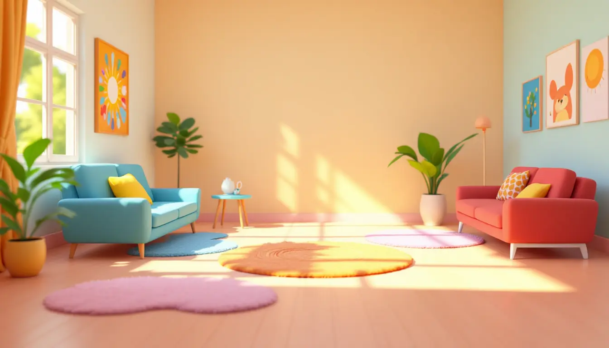
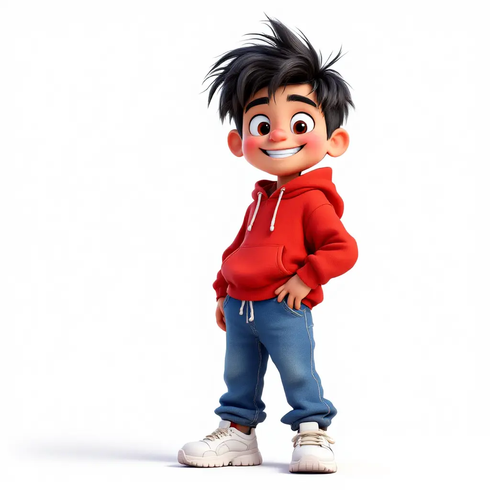
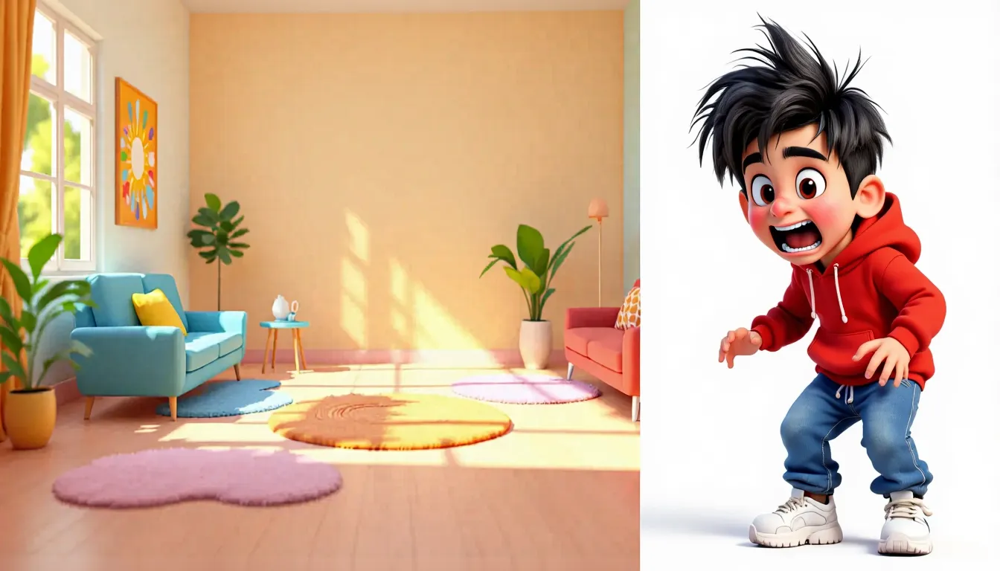
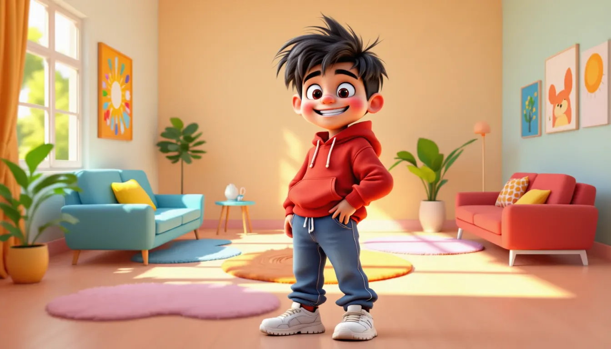
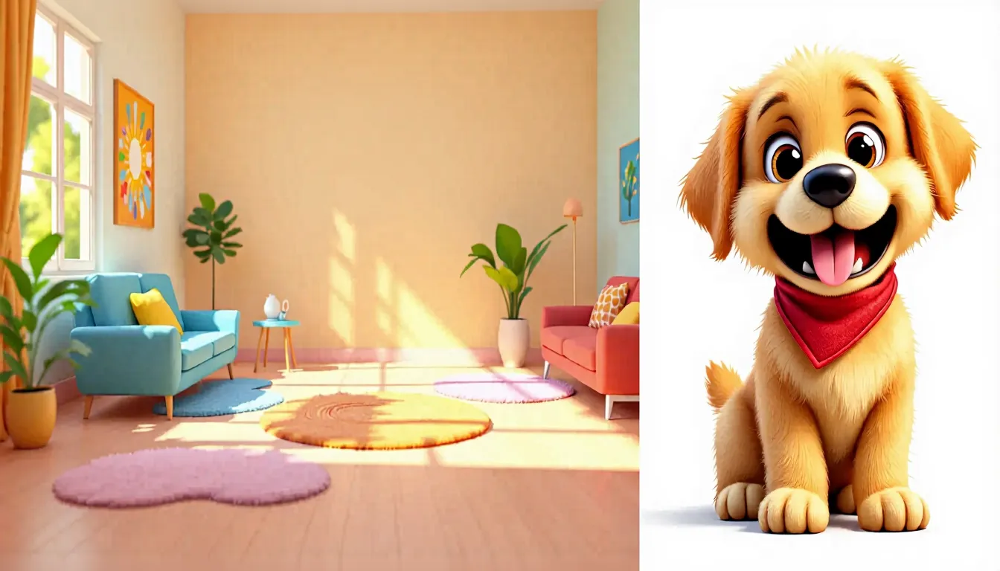
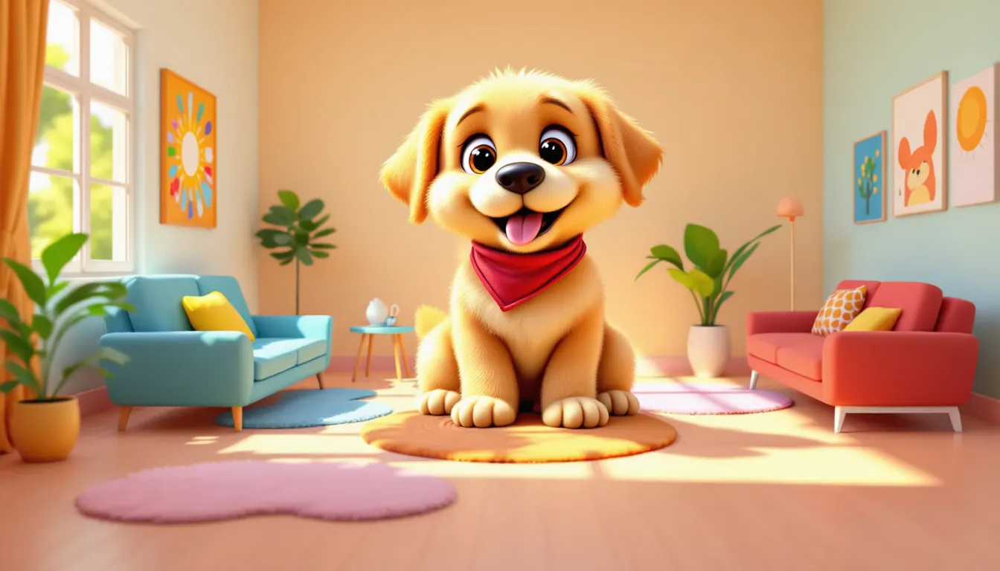
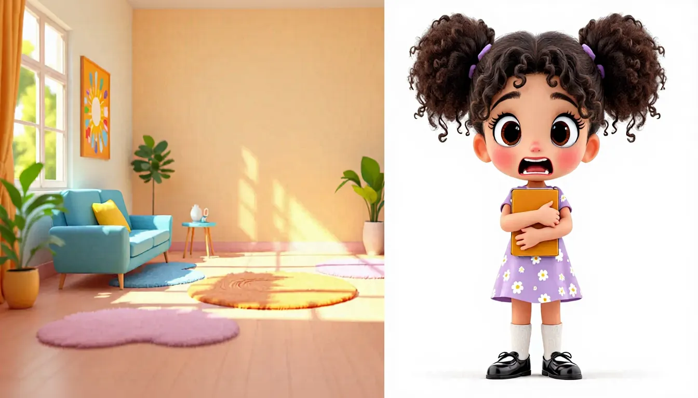
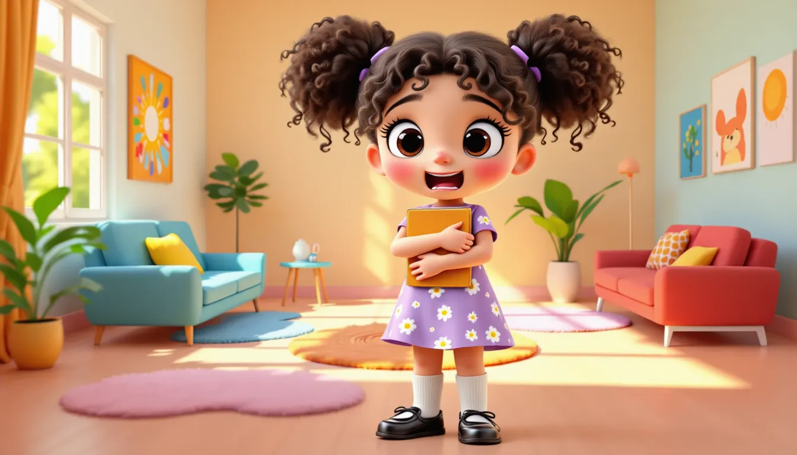
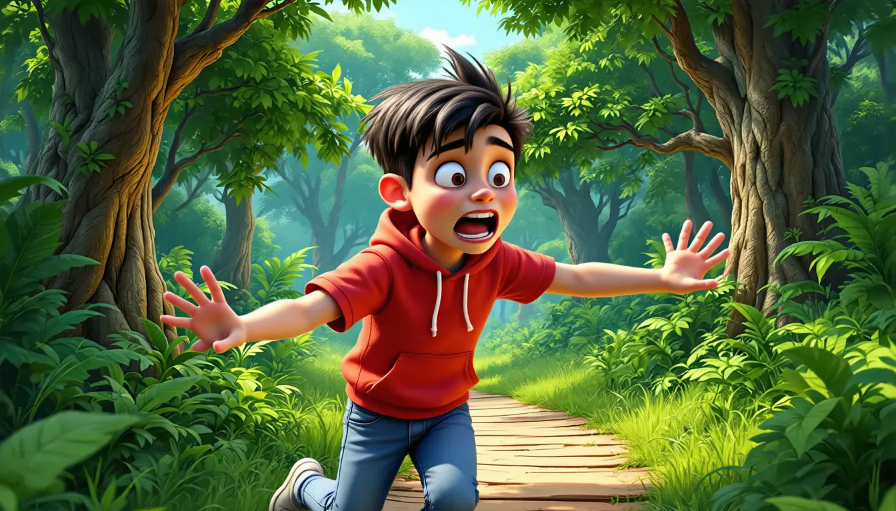
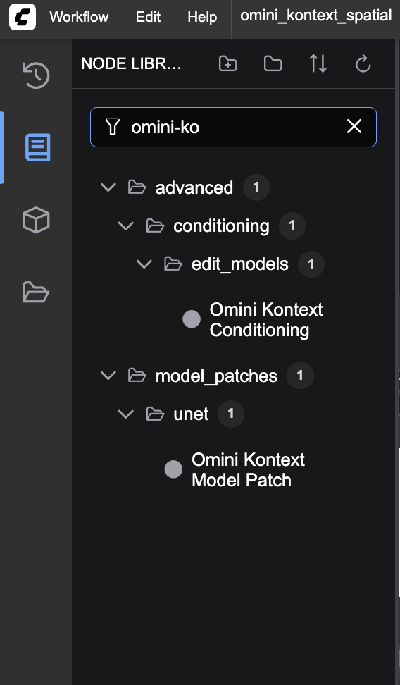

# Flux Omini Kontext framework for multi-image reference: training and inference

[](https://python.org)
[](https://pytorch.org)
[](https://lightning.ai)
[](LICENSE)


## Updates
- Qwen-Image-Edit support added. Spatial character insertion model available on HF(link below). this is experimental model, and not yet trained on large dataset. It sometimes insert duplicate characters.
- This repository includes nodes and patches for [ComfyUI](https://github.com/comfyanonymous/ComfyUI) that are compatible with the [Nunchaku](https://github.com/nunchaku-tech/ComfyUI-nunchaku/tree/v0.3.4) extension. So you can use nunchaku version of Flux Kontext model with Omini Kontext at lightning speed.


## 🚀 Live Demo


https://github.com/user-attachments/assets/e3397377-3599-499b-b9c8-77d14b60dd3f


Replicate version: https://replicate.com/thefluxtrain/omini-kontext

[Installation guides, workflows, turorials, and demos](https://thefluxtrain.com/research/omini-kontext-model/install/comfy-ui-inference-workflows)

If you have trained your own model, you can use it on replicate. You will have to upload the model on HF, and enter the details on replicate.

OminiKontext is a framework built around Flux.1-Kontext-dev model. We do not alter the model architecture, but rather we play around with 3D RoPE embeddings to enable reference based edits on a given image. 

The approach is heavily inspired from [OminiControl](https://github.com/Yuanshi9815/OminiControl) project, that uses the same RoPE embeddings trick to achieve reference based image generation using Flux.1 dev model. However, Flux.1 dev uses 2D RoPE embeddings, where as Kontext uses 3D RoPE embeddings. 

## More details on delta values-
Read this issue - https://github.com/Saquib764/omini-kontext/issues/12


## 🎨 Generated Samples

### Spatial Character Insertion

The following examples demonstrate how the trained model can insert cartoon characters into existing scenes. It takes a reference character with the desired position of character in an white image, and a scene image. The model will insert the character into the scene image at the desired position. The model takes a some freedom to place the character, around the desired position (not exactly at the desired position), based on the feasibility (common sense) of image. 

I used 30 image pair to train the model for intuitive blending task. Sometimes the results are not good, but overall the model is able to blend the character into the scene. This more like a POC. I plan to train another model(obviously opensource) with much larger dataset to make it more robust.

| Scene | Reference Character | Generated Result |
|-------|-------------------|------------------|
|  |  |  |
|  |  |  |
|  |  |  |

<details>
<summary><strong>📋 Click to expand/collapse more spatial character insertion examples</strong></summary>

| Scene | Reference Character | Generated Result |
|-------|-------------------|------------------|
|  |  |  |
|  |  |  |
|  |  |  |
|  |  |  |
|  |  |  |
|  |  |  |
|  |  |  |
|  |  |  |
|  |  |  |
|  |  |  |
|  |  |  |

</details>


### Non-spatial Character Insertion

The following examples demonstrate how the trained model can insert cartoon characters into existing scenes. There is not spatial control over the character in this case.

| Scene | Reference Character | Generated Result |
|-------|-------------------|------------------|
|  |  |  |
|  |  |  |


More comming soon!

### Model Comparison

The following table compares the performance of Omini Kontext model with a character insertion LoRA, against the vanilla FLUX.1-Kontext-dev model. For the comparision, we used `Add character to the image. The character is scared.` as the prompt for all the images.

| Scene | Reference | Vanilla | Omini |
|-------|-----------|---------|-------|
|  |  |  |  |
|  |  |  |  |

<details>
<summary><strong>📋 Click to expand/collapse more model comparison examples</strong></summary>

| Scene | Reference | Vanilla | Omini |
|-------|-----------|---------|-------|
|  |  |  |  |
|  |  |  |  |
|  |  |  |  |
|  |  |  |  |

</details>

## Pretrained LoRA models

| Model Name | Delta | Description |
|------------|-------|-------------|
| [character_3000.safetensors](https://huggingface.co/saquiboye/omini-kontext/blob/main/character_3000.safetensors) | [0,0,96] | On comfyUI, use cfg=1.5 , LoRA strength = 0.5-0.7. Character in white background. |
| [spatial-character-test.safetensors](https://huggingface.co/saquiboye/omini-kontext/blob/main/spatial-character-test.safetensors) | [1,0,0] | On comfyUI, use cfg=1.5 , LoRA strength = 0.5-0.7 . Upload the reference image of same size as the base image, with character placed corresponding to where you want it to be. |
| [product_2000.safetensors](https://huggingface.co/saquiboye/omini-kontext/blob/main/product_2000.safetensors) | [0,0,96] | On comfyUI, use cfg=1.5 , LoRA strength = 0.5-0.7. Product in white background. |

**Notes:**
1. Sometimes, the product or characters are too big compared to the rest of the scene, simply use a smaller resolution image.
2. Trained on 512x512 reference image, but works fine with 1024x1024

## 📋 To-do
- [ ] Add Qwen-Image-Edit support
- [ ] Extend to input multiple references.
- [ ] Create more demos for various usecases. Community support needed!
- [x] Add Nunchaku integration in ComfyUI
- [x] Use dataset from HF for training
- [x] Scrip to push dataset to huggingface
- [x] Create an **easy to use ComfyUI integration**, one that uses native comfyui nodes. Scroll to end.
- [x] Make a data processing script, available in helpers/dataset_creator.ipynb
- [x] Add ways to control location and scale of the reference character
- [x] Speed up by removing irrelevant pixels
- [x] Deploy a public demo
- [x] Deploy a replicate version
- [x] Add comfyUI integration - Scroll to bottom
- [x] Basic training script
- [x] Basic inference script

### Model training Plans
- [ ] **Qwen-Image-Edit character model**: Train character models for Qwen-Image-Edit.
- [ ] **Person Models**: Develop models for realistic human subjects
- [ ] **Clothes Models**: Create models for clothing and fashion items
- [x] **Subject Models**: Train models for specific objects and items
- [x] **Character Models**: Train specialized models for anime/cartoon characters


## 🚀 Quick Start

### Setup Environment

```bash
# Create conda environment
conda create -n omini-kontext python=3.10
conda activate omini-kontext

# Install dependencies
pip install -r requirements.txt
```

### Basic Training


## 📦 Installation

### Prerequisites

- **Python 3.8+**
- **CUDA-compatible GPU** (recommended: 24GB+ VRAM)
- **PyTorch 2.0+**
- **HuggingFace account** for model access

### Install Dependencies

```bash
# Core requirements
pip install torch>=2.0.0 lightning>=2.0.0

# Install diffusers from GitHub (required for FluxKontext pipeline)
pip install git+https://github.com/huggingface/diffusers

# Training-specific requirements
pip install -r requirements.txt
```

### Verify Installation

```python
import torch
from src.pipeline_flux_omini_kontext import FluxOminiKontextPipeline

# Test pipeline loading
pipe = FluxOminiKontextPipeline.from_pretrained(
    "black-forest-labs/FLUX.1-Kontext-dev"
)
print("✅ Installation successful!")
```

## 🎯 Usage

### Basic Inference

```python
from diffusers.utils import load_image
from src.pipeline_flux_omini_kontext import FluxOminiKontextPipeline
import torch

# Load pipeline
pipe = FluxOminiKontextPipeline.from_pretrained(
    "black-forest-labs/FLUX.1-Kontext-dev",
    torch_dtype=torch.bfloat16
)
pipe.to("cuda")

# Load images
input_image = load_image("path/to/input.jpg")
reference_image = load_image("path/to/reference.jpg")

# Load Character OminiKontext LoRA
pipe.load_lora_weights(
    "saquiboye/omini-kontext-character",
    weight_name="character_3000.safetensors",
    adapter_name="lora_weights"
)

# Generate
result = pipe(
    image=input_image,
    reference=reference_image,
    reference_delta=[0, 0, 96],  # Position delta for reference
    prompt="A beautiful landscape with mountains",
    guidance_scale=3.5,
    num_inference_steps=28
)

# Save result
result.images[0].save("output.png")
```

### Optimizing Reference Images

The `optimise_image_condition` function helps improve inference and training performance by preprocessing reference images to optimize token usage. This optimization removes irrelevant pixels while preserving the essential features needed for conditioning.

```python
from src.utils.image_utils import optimise_image_condition
from PIL import Image

# Load your reference image
reference = Image.open("path/to/reference.jpg")

# Optimize the reference image
reference_delta = [0, 0, 96]
optimised_reference, new_reference_delta = optimise_image_condition(reference, reference_delta)

# Use in inference
result = pipe(
    image=input_image,
    reference=optimized_reference,  # Pass the optimized reference
    reference_delta=new_reference_delta,
    prompt="A beautiful landscape with mountains",
    guidance_scale=3.5,
    num_inference_steps=28
)
```

## 🛠️ Training

### Data Preparation

Your training data should be organized as follows:

```
data/
├── start/          # Input images (960x512)
├── reference/      # Reference images (512x512)
└── end/           # Target images (896x512)
```

### Training Configuration

```python
# Training config
config = {
    "flux_pipe_id": "black-forest-labs/FLUX.1-Kontext-dev",
    "lora_config": {
        "r": 16,
        "lora_alpha": 32,
        "target_modules": ["to_q", "to_k", "to_v", "to_out.0"],
        "lora_dropout": 0.1,
        "bias": "none",
        "task_type": "CAUSAL_LM"
    },
    "optimizer_config": {
        "type": "AdamW",
        "params": {
            "lr": 1e-4,
            "weight_decay": 0.01,
            "betas": (0.9, 0.999)
        }
    },
    "gradient_checkpointing": True
}
```

### Start Training

```bash
# Basic training
python train/script/train.py --config train/config/basic.yaml

# Multi-GPU training
python train/script/train.py --config train/config/multi_gpu.yaml

# Resume training
python train/script/train.py --config train/config/resume.yaml --resume_from_checkpoint path/to/checkpoint.ckpt
```

### Training Monitoring

```python
# Monitor with TensorBoard
tensorboard --logdir runs/

# Monitor with Weights & Biases
wandb login
python train/script/train.py --config train/config/wandb.yaml
```

## 📚 Examples

### Character Insertion

See `examples/character_insert.ipynb` for a complete example of inserting characters into scenes.

**Trained Model**: Check out the [omini-kontext-character](https://huggingface.co/saquiboye/omini-kontext-character) model on Hugging Face, which is specifically trained to insert cartoon characters into existing scenes.


## 🏗️ Model Architecture

The Flux Omini Kontext pipeline consists of several key components:

### Base model
Flux Kontext dev model

### LoRA Integration

```python
# LoRA layers are applied to attention modules
target_modules = ["to_q", "to_k", "to_v", "to_out.0"]

# LoRA configuration
lora_config = {
    "r": 16,                    # Rank
    "lora_alpha": 32,           # Alpha scaling
    "lora_dropout": 0.1,        # Dropout rate
    "bias": "none",             # Bias handling
    "task_type": "CAUSAL_LM"    # Task type
}
```

### Training Process

1. **Input Processing**: Encode input and reference images
2. **Text Encoding**: Process prompts with CLIP and T5
3. **LoRA Forward**: Apply LoRA layers during forward pass
4. **Noise Prediction**: Train to predict noise
5. **Loss Computation**: MSE loss on noise prediction

## ⚙️ Configuration

### Pipeline Parameters

| Parameter | Type | Default | Description |
|-----------|------|---------|-------------|
| `image` | PIL.Image | None | Input image |
| `reference` | PIL.Image | None | Reference image |
| `reference_delta` | List[int] | [0, 0, 0] | Position offset for reference (specific to trained LoRA, recommended: [0, 0, (1024+512)//16]) |
| `prompt` | str | None | Text prompt |
| `prompt_2` | str | None | Secondary text prompt |
| `guidance_scale` | float | 3.5 | Classifier-free guidance scale |
| `num_inference_steps` | int | 28 | Number of denoising steps |
| `height` | int | 1024 | Output height |
| `width` | int | 1024 | Output width |

### Training Parameters

| Parameter | Type | Default | Description |
|-----------|------|---------|-------------|
| `learning_rate` | float | 1e-4 | Learning rate |
| `batch_size` | int | 1 | Training batch size |
| `max_epochs` | int | 10 | Maximum training epochs |
| `gradient_accumulation_steps` | int | 1 | Gradient accumulation steps |
| `warmup_steps` | int | 100 | Learning rate warmup steps |


### ComfyUI Integration
Simply clone this repo in your ComfyUI/custom_nodes folder. Using this integration will let you use the native ComfyUI nodes together with the OminiKontext nodes. There are two nodes in the repo - 
1. OminiKontextConditioning - To condition the model on a reference image, along with a delta value.
2. OminiKontextModelPatch - Patch for the Kontext model.

Drop this image in ComfyUI interface to load the workflow -




---

Alternative ComfyUI integration -

Repo link - https://github.com/tercumantanumut/ComfyUI-Omini-Kontext

Thanks to [tercumantanumut](https://github.com/tercumantanumut) for the ComfyUI integration!

## Star History

[](https://www.star-history.com/#Saquib764/omini-kontext&Timeline)

## 🤝 Contributing

We welcome contributions! Please see our contributing guidelines:

1. Fork the repository
2. Create a feature branch
3. Make your changes
4. Add tests if applicable
5. Submit a pull request

## 📄 License

This project is licensed under the Apache License 2.0 - see the [LICENSE](LICENSE) file for details.

## 🙏 Acknowledgments

- **Black Forest Labs** for the FLUX.1-Kontext-dev model
- **HuggingFace** for the diffusers library
- **PyTorch Lightning** for the training framework
- **PEFT** for LoRA implementation
- **[OminiControl](https://github.com/Yuanshi9815/OminiControl)** for the universal control framework for Diffusion Transformers
- **[ComfyUI-Omini-Kontext](https://github.com/tercumantanumut/ComfyUI-Omini-Kontext)** for the ComfyUI integration
## 📚 References

```bibtex
@article{omini-kontext,
  title={OminiKontext: Multi-image references for image to image instruction models},
  author={Saquib Alam},
  year={2025}
}
```

## 📞 Support

- **Issues**: [GitHub Issues](https://github.com/your-repo/issues)
- **Discussions**: [GitHub Discussions](https://github.com/your-repo/discussions)
- **Documentation**: [Full Documentation](https://your-docs-url.com)

---

**Made with ❤️ for the AI community** 
