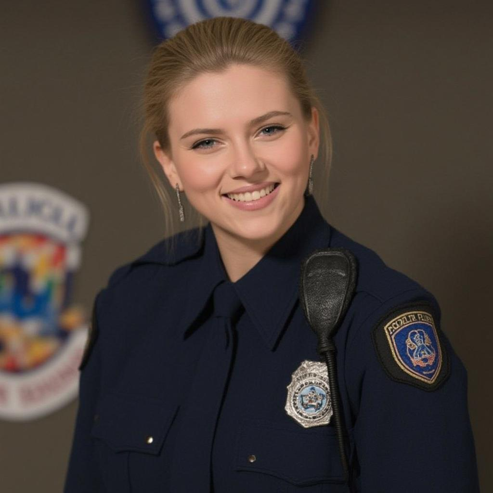

<p align="center">

  <h2 align="center"> ++: Instruction-Based Image Creation and Editing <br> via Context-Aware Content Filling </h2>

  <p align="center">
    <a href="https://arxiv.org/abs/2501.02487"></a>
    <a href='https://ali-vilab.github.io/ACE_plus_page/'></a>
    <a href='https://github.com/modelscope/scepter'></a>
    <a href='https://huggingface.co/spaces/scepter-studio/ACE-Plus'></a>
    <a href='https://huggingface.co/ali-vilab/ACE_Plus/tree/main'></a>
    <a href='https://modelscope.cn/models/iic/ACE_Plus/summary'></a>
    <br>
    <strong>Chaojie Mao</strong>
    ·
    <strong>Jingfeng Zhang</strong>
    ·
    <strong>Yulin Pan</strong>
    ·
    <strong>Zeyinzi Jiang</strong>
    ·
    <strong>Zhen Han</strong>
    <br>
    ·
    <strong>Yu Liu</strong>
    ·
    <strong>Jingren Zhou</strong>
    <br>
    Tongyi Lab, Alibaba Group
  </p>
  <table align="center">
    <tr>
    <td>
      
    </td>
    </tr>
  </table>

## 📚 Introduction

The original intention behind the design of ACE++ was to unify reference image generation, local editing, 
and controllable generation into a single framework, and to enable one model to adapt to a wider range of tasks. 
A more versatile model is often capable of handling more complex tasks. We have released three LoRA models for 
specific vertical domains and a more versatile FFT model (the performance of the FFT model declines compared 
to the LoRA model across various tasks). Users can flexibly utilize these models and their 
combinations for their own scenarios. 

## 📢 News
- [x] **[2025.01.06]** Release the code and models of ACE++.
- [x] **[2025.01.07]** Release the demo on [HuggingFace](https://huggingface.co/spaces/scepter-studio/ACE-Plus).
- [x] **[2025.01.16]** Release the training code for lora.
- [x] **[2025.02.15]** Collection of workflows in Comfyui.
- [x] **[2025.02.15]** Release the config for fully fine-tuning.
- [x] **[2025.03.03]** Release the fft model for ACE++, support more image to image tasks.
- [x] **[2025.03.11]** Release some comfyui workflow examples for ACE++ model. 

- We sincerely apologize 
for the delayed responses and updates regarding ACE++ issues. 
Further development of the ACE model through post-training on the FLUX model must be suspended. 
We have identified several significant challenges in post-training on the FLUX foundation. 
The primary issue is the high degree of heterogeneity between the training dataset and the FLUX model, 
which results in highly unstable training. Moreover, FLUX-Dev is a distilled model, and the influence of its original negative prompts on its final performance is uncertain.
As a result, subsequent efforts will be focused on post-training the ACE model using the Wan series of foundational models. __Due to the reasons mentioned earlier, the performance of the FFT model may decline compared 
to the LoRA model across various tasks. Therefore, we recommend continuing to use the LoRA model to achieve better results. 
We provide the FFT model with the hope that it may facilitate academic exploration and research in this area.__


## Models

### ACE++ Portrait LoRA

Portrait-consistent generation to maintain the consistency of the portrait.


<table><tbody>
  <tr>
    <td>Tuning Method</td>
    <td>Input</td>
    <td>Output</td>
    <td>Instruction</td>
    <td>Models</td>
  </tr>
  <tr>
    <td>LoRA <br>+ ACE Data</td>
    <td></td>
    <td></td>
    <td style="word-wrap:break-word;word-break:break-all;" width="250px";>"Maintain the facial features. A girl is wearing a neat police uniform and sporting a badge. She is smiling with a friendly and confident demeanor. The background is blurred, featuring a cartoon logo."</td>
    <td align="center" style="word-wrap:break-word;word-break:break-all;" width="200px";><a href="https://www.modelscope.cn/models/iic/ACE_Plus/"> </a> <a href="https://huggingface.co/ali-vilab/ACE_Plus/tree/main/portrait/"> </a> </td>
  </tr>
</tbody>
</table>


Models' scepter_path: 

- **ModelScope:** ms://iic/ACE_Plus@portrait/xxxx.safetensors

- **HuggingFace:** hf://ali-vilab/ACE_Plus@portrait/xxxx.safetensors


### ACE++ Subject LoRA

Subject-driven image generation task to maintain the consistency of a specific subject in different scenes.

<table><tbody>
  <tr>
    <td>Tuning Method</td>
    <td>Input</td>
    <td>Output</td>
    <td>Instruction</td>
    <td>Models</td>
  </tr>
  <tr>
    <td>LoRA <br>+ ACE Data</td>
    <td></td>
    <td></td>
    <td style="word-wrap:break-word;word-break:break-all;" width="250px";>"Display the logo in a minimalist style printed in white on a matte black ceramic coffee mug, alongside a steaming cup of coffee on a cozy cafe table."</td>
    <td align="center" style="word-wrap:break-word;word-break:break-all;" width="200px";><a href="https://www.modelscope.cn/models/iic/ACE_Plus/"> </a> <a href="https://huggingface.co/ali-vilab/ACE_Plus/tree/main/subject/"> </a> </td>
  </tr>
</tbody>
</table>


Models' scepter_path: 

- **ModelScope:** ms://iic/ACE_Plus@subject/xxxx.safetensors

- **HuggingFace:** hf://ali-vilab/ACE_Plus@subject/xxxx.safetensors


### ACE++ LocalEditing LoRA

Redrawing the mask area of images while maintaining the original structural information of the edited area.

<table><tbody>
  <tr>
    <td>Tuning Method</td>
    <td>Input</td>
    <td>Output</td>
    <td>Instruction</td>
    <td>Models</td>
  </tr>
  <tr>
    <td>LoRA <br>+ ACE Data</td>
    <td><br></td>
    <td></td>
    <td style="word-wrap:break-word;word-break:break-all;" width="250px";>"By referencing the mask, restore a partial image from the doodle {image} that aligns with the textual explanation: "1 white old owl"."</td>
    <td align="center" style="word-wrap:break-word;word-break:break-all;" width="200px";><a href="https://www.modelscope.cn/models/iic/ACE_Plus/"> </a> <a href="https://huggingface.co/ali-vilab/ACE_Plus/tree/main/local_editing/"> </a> </td>
  </tr>
</tbody>

</table>


Models' scepter_path: 

- **ModelScope:** ms://iic/ACE_Plus@local_editing/xxxx.safetensors

- **HuggingFace:** hf://ali-vilab/ACE_Plus@local_editing/xxxx.safetensors

### ACE++ FFT model  
Fully finetuning a composite model with ACE’s data to support various editing and reference generation tasks through an instructive approach.

We introduced 64 additional channels in the channel dimension to differentiate between the repainting task and the editing task. In these channels, we place the latent representation of the pixel space from the edited image, while keeping other channels consistent with the repainting task. One issue with this approach is that it changes the input channel number of the FLUX-Fill-Dev model from 384 to 448. The specific configuration can be referenced in the [configuration file](config/ace_plus_fft.yaml).


### Examples
The ACE++ model supports a wide range of downstream tasks through simple adaptations. Here are some examples.

<table><tbody>
  <tr>
    <th align="center" colspan="1">ACE++ Model</th>
    <td>Input Reference Image</td>
    <td>Input Edit Image</td>
    <td>Input Edit Mask</td>
    <td>Output</td>
    <td>Instruction</td>
    <td>Function</td>
  </tr>
  <tr>
    <td>Portrait LoRA(recommended) / FFT model</td>
    <td></td>
    <td></td>
    <td></td>
    <td></td>
    <td style="word-wrap:break-word;word-break:break-all;" width="250px";>"Maintain the facial features, A girl is wearing a neat police uniform and sporting a badge. She is smiling with a friendly and confident demeanor. The background is blurred, featuring a cartoon logo."</td>
    <td style="word-wrap:break-word;word-break:break-all;" width="250px";>"Character ID Consistency Generation"</td>
  </tr>
  <tr>
    <td>Subject LoRA(recommended) / FFT model</td>
    <td></td>
    <td></td>
    <td></td>
    <td></td>
    <td style="word-wrap:break-word;word-break:break-all;" width="250px";>"Display the logo in a minimalist style printed in white on a matte black ceramic coffee mug, alongside a steaming cup of coffee on a cozy cafe table."</td>
    <td style="word-wrap:break-word;word-break:break-all;" width="250px";>"Subject Consistency Generation"</td>
  </tr>
  <tr>
    <td>Subject LoRA(recommended) / FFT model</td>
    <td></td>
    <td></td>
    <td></td>
    <td></td>
    <td style="word-wrap:break-word;word-break:break-all;" width="250px";>"The item is put on the table."</td>
    <td style="word-wrap:break-word;word-break:break-all;" width="250px";>"Subject Consistency Editing"</td>
  </tr>
  <tr>
    <td>Subject LoRA(recommended) / FFT model</td>
    <td></td>
    <td></td>
    <td></td>
    <td></td>
    <td style="word-wrap:break-word;word-break:break-all;" width="250px";>"The logo is printed on the headphones."</td>
    <td style="word-wrap:break-word;word-break:break-all;" width="250px";>"Subject Consistency Editing"</td>
  </tr>
  <tr>
    <td>Subject LoRA(recommended) / FFT model</td>
    <td></td>
    <td></td>
    <td></td>
    <td></td>
    <td style="word-wrap:break-word;word-break:break-all;" width="250px";>"The woman dresses this skirt."</td>
    <td style="word-wrap:break-word;word-break:break-all;" width="250px";>"Try On"</td>
  </tr>
  <tr>
    <td>Portrait LoRA(recommended) / FFT model</td>
    <td></td>
    <td></td>
    <td></td>
    <td></td>
    <td style="word-wrap:break-word;word-break:break-all;" width="250px";>"{image}, the man faces the camera."</td>
    <td style="word-wrap:break-word;word-break:break-all;" width="250px";>"Face swap"</td>
  </tr>
 <tr>
    <td>FFT model</td>
    <td></td>
    <td></td>
    <td></td>
    <td></td>
    <td style="word-wrap:break-word;word-break:break-all;" width="250px";>"{image} features a close-up of a young, furry tiger cub on a rock. The tiger, which appears to be quite young, has distinctive orange, black, and white striped fur, typical of tigers. The cub's eyes have a bright and curious expression, and its ears are perked up, indicating alertness. The cub seems to be in the act of climbing or resting on the rock. The background is a blurred grassland with trees, but the focus is on the cub, which is vividly colored while the rest of the image is in grayscale, drawing attention to the tiger's details. The photo captures a moment in the wild, depicting the charming and tenacious nature of this young tiger, as well as its typical interaction with the environment."</td>
    <td style="word-wrap:break-word;word-break:break-all;" width="250px";>"Super-resolution"</td>
  </tr>
  <tr>
    <td>FFT model</td>
    <td></td>
    <td></td>
    <td></td>
    <td></td>
    <td style="word-wrap:break-word;word-break:break-all;" width="250px";>"a blue hand"</td>
    <td style="word-wrap:break-word;word-break:break-all;" width="250px";>"Regional Editing"</td>
  </tr>
  <tr>
    <td>FFT model</td>
    <td></td>
    <td></td>
    <td></td>
    <td></td>
    <td style="word-wrap:break-word;word-break:break-all;" width="250px";>"Mechanical  hands like a robot"</td>
    <td style="word-wrap:break-word;word-break:break-all;" width="250px";>"Regional Editing"</td>
  </tr>
  <tr>
    <td>Local Editing LoRA/FFT model</td>
    <td></td>
    <td></td>
    <td></td>
    <td></td>
    <td style="word-wrap:break-word;word-break:break-all;" width="250px";>"{image} Beautiful female portrait, Robot with smooth White transparent carbon shell, rococo detailing, Natural lighting, Highly detailed, Cinematic, 4K."</td>
    <td style="word-wrap:break-word;word-break:break-all;" width="250px";>"Recolorizing"</td>
  </tr>

  <tr>
    <td>Local Editing LoRA/FFT model</td>
    <td></td>
    <td></td>
    <td></td>
    <td></td>
    <td style="word-wrap:break-word;word-break:break-all;" width="250px";>"{image} Beautiful female portrait, Robot with smooth White transparent carbon shell, rococo detailing, Natural lighting, Highly detailed, Cinematic, 4K."</td>
    <td style="word-wrap:break-word;word-break:break-all;" width="250px";>"Depth Guided Generation"</td>
  </tr>
  <tr>
    <td>Local Editing LoRA/FFT model</td>
    <td></td>
    <td></td>
    <td></td>
    <td></td>
    <td style="word-wrap:break-word;word-break:break-all;" width="250px";>"{image} Beautiful female portrait, Robot with smooth White transparent carbon shell, rococo detailing, Natural lighting, Highly detailed, Cinematic, 4K."</td>
    <td style="word-wrap:break-word;word-break:break-all;" width="250px";>"Contour Guided Generation"</td>
  </tr>
</tbody>
</table>

##  Comfyui Workflows in community
We are deeply grateful to the community developers for building many fascinating applications based on the ACE++ series of models. 
During this process, we have received valuable feedback, particularly regarding artifacts in generated images and the stability of the results. 
In response to these issues, many developers have proposed creative solutions, which have greatly inspired us, and we pay tribute to them. 
At the same time, we will take these concerns into account in our further optimization efforts, carefully evaluating and testing before releasing new models.

In the table below, we have briefly listed some workflows for everyone to use.

<table><tbody>
  <tr>
    <td>Workflow</td>
    <td>Author</td>
    <td>Example</td>
  </tr>
  <tr>
    <td><a href="https://www.runninghub.cn/post/1890052281759571970"> 【飞翔鲸】王炸！FLUX+ACE++换头 </a> </td>
    <td><a href="https://www.runninghub.cn/user-center/1851827947798740994"> 飞翔鲸 </a></td>
    <td></td>
  </tr>
  <tr>
    <td><a href="https://www.runninghub.cn/post/1890014204382916609"> 最新ACE++ Redux 万物迁移 AI模特换装 UP 楚门的AI世界 </a> </td>
    <td><a href="https://www.runninghub.cn/user-center/1865415077888405506"> 楚门的AI世界 </a></td>
    <td></td>
  </tr>
  <tr>
    <td><a href="https://openart.ai/workflows/t8star/ace-plusfillredux/bgQDNz8SeySMDqn13ZBv"> Ace Plus+Fill+Redux稳定无抽卡换装工作流</a> </td>
    <td><a href="https://openart.ai/workflows/profile/t8star?sort=latest"> T8star-Aix </a></td>
    <td></td>
  </tr>
  <tr>
    <td><a href="https://openart.ai/workflows/t8star/ace-plusfillredux/ifIvaWXW9QkLtNV405j7"> Ace Plus+Fill+Redux稳定少抽卡标志工作流</a> </td>
    <td><a href="https://openart.ai/workflows/profile/t8star?sort=latest"> T8star-Aix </a></td>
    <td></td>
  </tr>
  <tr>
    <td><a href="https://openart.ai/workflows/t8star/ace-plusfillredux/WdwUwGXPLHhnSOlSEfTg"> Ace Plus+Fill+Redux稳定无抽卡换脸工作流</a> </td>
    <td><a href="https://openart.ai/workflows/profile/t8star?sort=latest"> T8star-Aix </a></td>
    <td></td>
  </tr>
  <tr>
    <td><a href="https://openart.ai/workflows/cat_untimely_42/ace-face-swap-in-different-styles/VocvdfQrvDhmKNLEBwJY"> ace++ face swap in different styles </a> </td>
    <td><a href="https://openart.ai/workflows/profile/cat_untimely_42?sort=latest"> jax </a></td>
    <td></td>
  </tr>
  <tr>
    <td><a href="https://openart.ai/workflows/leeguandong/fllux-ace-subject-without-reference-image/HjYf6Eae2PRGACJWXdrE"> fllux ace++ subject without reference image </a> </td>
    <td><a href="https://openart.ai/workflows/profile/leeguandong?sort=latest"> leeguandong </a></td>
    <td></td>
  </tr>
  <tr>
    <td><a href="https://openart.ai/workflows/whale_waterlogged_60/scepter-ace-more-convenient-replacement-of-everything/gjAsh5rGjfC6OEB2AUZv"> Scepter-ACE++ More convenient replacement of everything</a> </td>
    <td><a href="https://openart.ai/workflows/profile/whale_waterlogged_60?sort=latest"> HaoBeen </a></td>
    <td></td>
  </tr>
</tbody>
</table>

Additionally, many bloggers have published tutorials on how to use it, which are listed in the table below.

<table><tbody>
  <tr>
    <td>Tutorial</td>
  </tr>
  <tr>
    <td><a href="https://www.youtube.com/watch?v=5OwcxugdWxI"> Best Faceswapper I've Seen. ACE++ in ComfyUI. </a> </td>
  </tr>
  <tr>
    <td><a href="https://www.youtube.com/watch?v=2fgT35H_tuE&pp=ygUIYWNlIHBsdXM%3D"> ACE ++ In ComfyUI All-round Creator & Editor - More Than Just A Faceswap AI </a> </td>
  </tr>
  <tr>
    <td><a href="https://www.youtube.com/watch?v=XU376PzgnXc"> Ai绘画进阶140-咦？大家用的都不对？！Ace Plus工作流正确搭建方式及逻辑，参数详解，Flux Fill，Redux联用-T8 Comfyui教程</a> </td>
  </tr>
  <tr>
    <td><a href="https://www.youtube.com/watch?v=1cbOkN0mTw0"> ace++：告别 Lora 训练，无需pulid，轻松打造专属角色！ | No Lora Training, Easily Create Exclusive Characters!</a> </td>
  </tr>
  <tr>
    <td><a href="https://www.youtube.com/watch?v=0wMoWSTm5Hc"> Ace++ and Flux Fill: Advanced Face Swapping Made Easy in ComfyUI | No Lora Training, Easily Create Exclusive Characters!</a> </td>
  </tr>
  <tr>
    <td><a href="https://www.youtube.com/watch?v=7GrkIFuRQAc"> ComfyUI - ACE Plus Subject Portrait Lora </a> </td>
  </tr>
  <tr>
    <td><a href="https://www.bilibili.com/video/BV1HiKpeuE8o/?spm_id_from=333.337.search-card.all.click&vd_source=927630f34c77eee560afd69cfdba3f47"> 🤗AI一致性技术新突破！ACE++技术一致性comfyui工作流🍋‍ </a> </td>
  </tr>
  <tr>
    <td><a href="https://www.bilibili.com/video/BV1obN9enEvp/?spm_id_from=333.337.search-card.all.click&vd_source=927630f34c77eee560afd69cfdba3f47"> ComfyUI 第55集 人像换脸 FLUX的FILL模型+ACE LORA </a> </td>
  </tr>
  <tr>
    <td><a href="https://www.bilibili.com/video/BV1pPN3eBEtr/?spm_id_from=333.337.search-card.all.click&vd_source=927630f34c77eee560afd69cfdba3f47"> 换装变脸贴logo，无所不能的Ace_Plus lora </a> </td>
  </tr>
</tbody>
</table>

## ComfyUI Workflow Examples

Copy the workflow/ComfyUI-ACE_Plus folder into ComfyUI’s custom_nodes directory. Launch ComfyUI, and we have provided some example workflows in workflow_example with the following explanations. It is recommended to use the LoRA model workflow, as it offers more stable results compared to the FFT model.

<table><tbody>
  <tr>
    <td>Workflow</td>
    <td>Description</td>
    <td>Other dependency models</td>
    <td>Setting</td>
  </tr>
  <tr>
    <td>ACE_Plus_LoRA_workflow_reference_generation.json</td>
    <td>Reference image generation capability for portrait or subject.</td>
    <td>Potrait or subject LoRA Model + FLUX.1-Fill-dev</td>
    <td>Task_type: repainting (you don't need to install dependencies like scepter)</td>
  </tr>
  <tr>
    <td>ACE_Plus_LoRA_workflow_redux_reference_generation.json</td>
    <td>Reference image generation capability for portrait or subject used in conjunction with Redux.</td>
    <td>Potrait or subject LoRA Model + FLUX.1-Fill-dev + FLUX.1-Redux</td>
    <td>Task_type: repainting (you don't need to install dependencies like scepter)</td>
  </tr>
  <tr>
    <td>ACE_Plus_LoRA_workflow_reference_editing.json</td>
    <td>Reference image editing capability such as logo paste, face swap.</td>
    <td>Potrait or subject LoRA Model + FLUX.1-Fill-dev</td>
    <td>Task_type: repainting (you don't need to install dependencies like scepter)</td>
  </tr>
  <tr>
    <td>ACE_Plus_LoRA_workflow_redux_reference_editing.json</td>
    <td>Reference image editing capability such as logo paste, face swap used in conjunction with Redux.</td>
    <td>Potrait or subject LoRA Model + FLUX.1-Fill-dev + FLUX.1-Redux</td>
    <td>Task_type: repainting (you don't need to install dependencies like scepter)</td>
  </tr>
  <tr>
    <td>ACE_Plus_LoRA_workflow_localcontrol_generation.json</td>
    <td>Controllable image-to-image translation capability. To preprocess depth and contour information from images, 
    we use externally-provided models that are typically downloaded from the ModelScope Hub. Because download success 
    can vary depending on the user's environment, we offer alternatives: users can either leverage existing community 
    nodes (depth extration node or contour extraction node) for this task (then choosing the 'no_preprocess' option), 
    or users can pre-download the required models 
    <a href="https://www.modelscope.cn/models/iic/scepter_annotator/file/view/master?fileName=annotator%252Fckpts%252Finformative_drawing_contour_style.pth&status=2">contour</a> and
    <a href="https://www.modelscope.cn/models/iic/scepter_annotator/file/view/master?fileName=annotator%252Fckpts%252Fdpt_hybrid-midas-501f0c75.pt&status=2">depth</a>    
    and adjust
    the configuration file 'workflow/ComfyUI-ACE_Plus/config/ace_plus_fft_processor.yaml' to
    specify the models' local paths.</td>
    <td>Local editing LoRA Model + FLUX.1-Fill-dev + Preprocessing model (depth or contour) </td>
    <td>Task_type: contour_repainting/depth_repainting/recolorizing (you need to install dependencies like scepter)</td>
  </tr>
  <tr>
    <td>ACE_Plus_FFT_workflow_referenceediting_generation.json</td>
    <td>Reference image editing capability</td>
    <td>FFT model</td>
    <td>Task_type: repainting (you don't need to install dependencies like scepter)</td>
  </tr>
  <tr>
    <td>ACE_Plus_FFT_workflow_no_preprocess.json</td>
    <td>Use the preprocessed images, such as depth and contour, as input, or the super-resolution.</td>
    <td>FFT model</td>
    <td>Task_type: no_preprocess (you don't need to install dependencies like scepter)</td>
  </tr>
  <tr>
    <td>ACE_Plus_FFT_workflow_controlpreprocess.json</td>
    <td>Controllable image-to-image translation capability. To preprocess depth and contour information from images, 
    we use externally-provided models that are typically downloaded from the ModelScope Hub. Because download success 
    can vary depending on the user's environment, we offer alternatives: users can either leverage existing community 
    nodes (depth extration node or contour extraction node) for this task (then choosing the 'no_preprocess' option), 
    or users can pre-download the required models 
    <a href="https://www.modelscope.cn/models/iic/scepter_annotator/file/view/master?fileName=annotator%252Fckpts%252Finformative_drawing_contour_style.pth&status=2">contour</a> and
    <a href="https://www.modelscope.cn/models/iic/scepter_annotator/file/view/master?fileName=annotator%252Fckpts%252Fdpt_hybrid-midas-501f0c75.pt&status=2">depth</a>    
    and adjust
    the configuration file 'workflow/ComfyUI-ACE_Plus/config/ace_plus_fft_processor.yaml' to
    specify the models' local paths.</td>
    <td>FFT model</td>
    <td>Task_type: contour_repainting/depth_repainting/recolorizing (you need to install dependencies like scepter)</td>
  </tr>
  <tr>
    <td>ACE_Plus_FFT_workflow_reference_generation.json</td>
    <td>Reference image generation capability for portrait or subject.</td>
    <td>FFT model</td>
    <td>Task_type: repainting (you don't need to install dependencies like scepter)</td>
  </tr>
  <tr>
    <td>ACE_Plus_FFT_workflow_referenceediting_generation.json</td>
    <td>Reference image editing capability</td>
    <td>FFT model</td>
    <td>Task_type: repainting (you don't need to install dependencies like scepter)</td>
  </tr>
 <tbody>
<table>

As shown in the figure below, max_seq_length controls the length of the token sequence during inference, thereby controlling the model's inference memory consumption. 
The range of this value is from 2048 to 8192, and it correspondingly affects the clarity of the generated image. The smaller the value, the lower the image clarity.


## ⚙️️ Installation
Download the code using the following command:
```bash
git clone https://github.com/ali-vilab/ACE_plus.git
```

Install the necessary packages with `pip`: 
```bash
cd ACE_plus
pip install -r repo_requirements.txt
```
ACE++ depends on FLUX.1-Fill-dev as its base model, which you can download from [](https://huggingface.co/black-forest-labs/FLUX.1-Fill-dev). 
In order to run the inference code or Gradio demo normally, we have defined the relevant environment variables to specify the location of the model. 
For model preparation, we provide three methods for downloading the model. The summary of relevant settings is as follows.

|   Model Downloading Method    | Clone to Local Path                                                                                                                                                                                                                                         | Automatic Downloading during Runtime<br>(Setting the Environment Variables using scepter_path in [ACE Models](#-ace-models))                                                                                                       |
|:-----------------------------:|:------------------------------------------------------------------------------------------------------------------------------------------------------------------------------------------------------------------------------------------------------------|:-----------------------------------------------------------------------------------------------------------------------------------------------------------------------------------------------------------------------------------|
| Environment Variables Setting | <pre><code>export FLUX_FILL_PATH="path/to/FLUX.1-Fill-dev"<br>export PORTRAIT_MODEL_PATH="path/to/ACE++ PORTRAIT PATH"<br>export SUBJECT_MODEL_PATH="path/to/ACE++ SUBJECT PATH"<br>export LOCAL_MODEL_PATH="path/to/ACE++ LOCAL EDITING PATH"</code></pre> | <pre><code>export FLUX_FILL_PATH="hf://black-forest-labs/FLUX.1-Fill-dev"<br>export PORTRAIT_MODEL_PATH="${scepter_path}"<br>export SUBJECT_MODEL_PATH="${scepter_path}"<br>export LOCAL_MODEL_PATH="${scepter_path}"</code></pre> |

## 🚀 Inference
Under the condition that the environment variables defined in [Installation](#-installation), users can run examples and test your own samples by executing infer.py. 
The relevant commands for lora models are as follows:
```bash
export FLUX_FILL_PATH="hf://black-forest-labs/FLUX.1-Fill-dev"
export PORTRAIT_MODEL_PATH="ms://iic/ACE_Plus@portrait/comfyui_portrait_lora64.safetensors"                                                                                                                                      
export SUBJECT_MODEL_PATH="ms://iic/ACE_Plus@subject/comfyui_subject_lora16.safetensors"                                                                                                                                         
export LOCAL_MODEL_PATH="ms://iic/ACE_Plus@local_editing/comfyui_local_lora16.safetensors" 
# Use the model from huggingface
# export PORTRAIT_MODEL_PATH="hf://ali-vilab/ACE_Plus@portrait/comfyui_portrait_lora64.safetensors"        
# export SUBJECT_MODEL_PATH="hf://ali-vilab/ACE_Plus@subject/comfyui_subject_lora16.safetensors"        
# export LOCAL_MODEL_PATH="hf://ali-vilab/ACE_Plus@local_editing/comfyui_local_lora16.safetensors" 
python infer_lora.py
```
The relevant commands for fft models are as follows:
```bash
export FLUX_FILL_PATH="hf://black-forest-labs/FLUX.1-Fill-dev"
export ACE_PLUS_FFT_MODEL="ms://iic/ACE_Plus@ace_plus_fft.safetensors.safetensors"                                                                                                                                      
python infer_fft.py
```

## 🚀 Train
We provide training code that allows users to train on their own data. Reference the data in 'data/train.csv' and 'data/eval.csv' to construct the training data and test data, respectively. We use '#;#' to separate fields. 
The required fields include the following six, with their explanations as follows.
```angular2html
"edit_image": represents the input image for the editing task. If it is not an editing task but a reference generation, this field can be left empty.
"edit_mask": represents the input image mask for the editing task, used to specify the editing area. If it is not an editing task but rather for reference generation, this field can be left empty.
"ref_image": represents the input image for the reference image generation task; if it is a pure editing task, this field can be left empty.
"target_image": represents the generated target image and cannot be empty.
"prompt": represents the prompt for the generation task.
"data_type": represents the type of data, which can be 'portrait', 'subject', or 'local'. This field is not used in training phase.
```

All parameters related to training are stored in 'train_config/ace_plus_lora.yaml'. With the following default configuration, the memory usage for LoRA training is between 38GB and 40GB. 

| Hyperparameter | Value     | Description |
| --- | --- | --- |
| ATTN_BACKEND |   flash_attn / pytorch  |Set 'flash_attn' to use flash_attn2(Make sure you have installed flash-attn2 correctly). If the version of PyTorch is greater than 2.4.0, use 'pytorch' to utilize PyTorch's implementation.|
| USE_GRAD_CHECKPOINT |   True / False  |Using gradient checkpointing can also significantly reduce GPU memory usage, but it may slow down the training speed. |
| MAX_SEQ_LEN |   2048  | The MAX_SEQ_LEN refers to the sequence size limit for a single input image (calculated as H/16 * W/16). A larger value indicates a longer computation sequence and a higher training resolution. The default value I provided is 2048.|

To run the training code, execute the following command.


```bash
export FLUX_FILL_PATH="{path to FLUX.1-Fill-dev}"
python run_train.py  --cfg train_config/ace_plus_lora.yaml
# Training from fft model
export FLUX_FILL_PATH="{path to FLUX.1-Fill-dev}"
export ACE_PLUS_FFT_MODEL="path to ace_plus_fft.safetensors.safetensors"       
python run_train.py  --cfg train_config/ace_plus_fft.yaml 
```

The models trained by ACE++ can be found in ./examples/exp_example/xxxx/checkpoints/xxxx/0_SwiftLoRA/comfyui_model.safetensors.

## 💻 Demo
We have built a GUI demo based on Gradio to help users better utilize the ACE++ model. Just execute the following command.
```bash
export FLUX_FILL_PATH="hf://black-forest-labs/FLUX.1-Fill-dev"
export PORTRAIT_MODEL_PATH="ms://iic/ACE_Plus@portrait/comfyui_portrait_lora64.safetensors"                                                                                                                                      
export SUBJECT_MODEL_PATH="ms://iic/ACE_Plus@subject/comfyui_subject_lora16.safetensors"                                                                                                                                         
export LOCAL_MODEL_PATH="ms://iic/ACE_Plus@local_editing/comfyui_local_lora16.safetensors" 
# Use the model from huggingface
# export PORTRAIT_MODEL_PATH="hf://ali-vilab/ACE_Plus@portrait/comfyui_portrait_lora64.safetensors"        
# export SUBJECT_MODEL_PATH="hf://ali-vilab/ACE_Plus@subject/comfyui_subject_lora16.safetensors"        
# export LOCAL_MODEL_PATH="hf://ali-vilab/ACE_Plus@local_editing/comfyui_local_lora16.safetensors" 
python demo_lora.py
# Use the fft model
export FLUX_FILL_PATH="hf://black-forest-labs/FLUX.1-Fill-dev"
export ACE_PLUS_FFT_MODEL="ms://iic/ACE_Plus@ace_plus_fft.safetensors.safetensors"       
python demo_fft.py
```


## 📚 Limitations
* For certain tasks, such as deleting and adding objects, there are flaws in instruction following. For adding and replacing objects, we recommend trying the repainting method of the local editing model to achieve this.
* The generated results may contain artifacts, especially when it comes to the generation of hands, which still exhibit distortions.

## 📝 Citation
ACE++ is a post-training model based on the FLUX.1-dev series from black-forest-labs. Please adhere to its open-source license. The test materials used in ACE++ come from the internet and are intended for academic research and communication purposes. If the original creators feel uncomfortable, please contact us to have them removed. 

If you use this model in your research, please cite the works of FLUX.1-dev and the following papers:
```bibtex
@article{mao2025ace++,
  title={ACE++: Instruction-Based Image Creation and Editing via Context-Aware Content Filling},
  author={Mao, Chaojie and Zhang, Jingfeng and Pan, Yulin and Jiang, Zeyinzi and Han, Zhen and Liu, Yu and Zhou, Jingren},
  journal={arXiv preprint arXiv:2501.02487},
  year={2025}
}
```
```bibtex
@article{han2024ace,
  title={ACE: All-round Creator and Editor Following Instructions via Diffusion Transformer},
  author={Han, Zhen and Jiang, Zeyinzi and Pan, Yulin and Zhang, Jingfeng and Mao, Chaojie and Xie, Chenwei and Liu, Yu and Zhou, Jingren},
  journal={arXiv preprint arXiv:2410.00086},
  year={2024}
}
```
