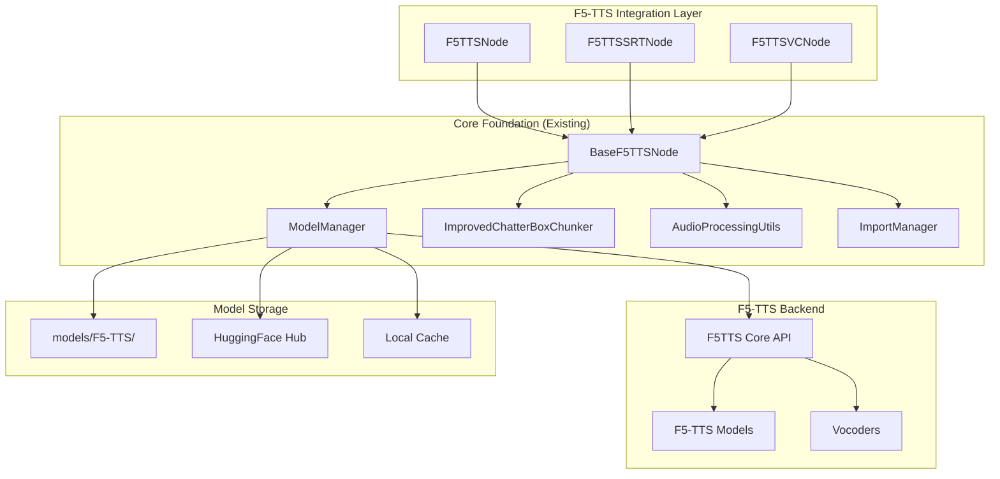

# F5-TTS Integration Architecture for ChatterBox Voice ComfyUI Extension

## Executive Summary

This document provides a comprehensive technical specification for integrating F5-TTS functionality into the existing ChatterBox Voice ComfyUI extension. The integration will include 3 new nodes following established patterns:

1. **F5TTSNode**: Basic text-to-speech generation with reference audio + text
2. **F5TTSSRTNode**: SRT subtitle support with F5-TTS backend  
3. **F5TTSVCNode**: Voice conversion using F5-TTS capabilities (where supported)

## Architecture Overview



## File Structure and Organization

```
chatterbox_voice_extension/
├── chatterbox/
│   └── f5tts/                     # New F5-TTS integration package
│       ├── __init__.py
│       ├── f5tts.py              # Core F5-TTS wrapper class
│       ├── model_loader.py       # F5-TTS model loading logic
│       └── vocoder_manager.py    # Vocoder management
├── core/
│   ├── f5tts_model_manager.py    # F5-TTS model manager extension
│   └── f5tts_audio_processing.py # F5-TTS specific audio utils
├── nodes/
│   ├── f5tts_base_node.py        # Base class for F5-TTS nodes
│   ├── f5tts_node.py             # Basic F5-TTS generation node
│   ├── f5tts_srt_node.py         # F5-TTS SRT support node
│   └── f5tts_vc_node.py          # F5-TTS voice conversion node
└── requirements_f5tts.txt         # F5-TTS specific dependencies
```

## Key Technical Requirements Analysis

### F5-TTS vs ChatterBox Differences:
1. **Reference Input**: F5-TTS requires **both** reference audio AND reference text (ChatterBox uses just audio)
2. **Sample Rate**: F5-TTS uses **24kHz** (ChatterBox uses 22kHz)
3. **Model Architecture**: F5-TTS uses DiT/UNetT models (ChatterBox uses T3/S3Gen)
4. **Dependencies**: F5-TTS has different requirements (cached_path, omegaconf, etc.)

## Core Implementation Specification

### 1. BaseF5TTSNode Class

```python
# nodes/f5tts_base_node.py
class BaseF5TTSNode(BaseChatterBoxNode):
    """
    Base class for F5-TTS nodes extending ChatterBox foundation.
    Handles F5-TTS specific requirements while maintaining compatibility.
    """
    
    def __init__(self):
        super().__init__()
        self.f5tts_model = None
        self.f5tts_sample_rate = 24000  # F5-TTS standard sample rate
        
    def load_f5tts_model(self, model_name: str = "F5TTS_Base", device: str = "auto"):
        """Load F5-TTS model using enhanced model manager"""
        
    def generate_f5tts_audio(self, text: str, ref_audio_path: str, ref_text: str, **kwargs):
        """Generate audio using F5-TTS with reference audio+text"""
        
    def handle_f5tts_reference(self, reference_audio, audio_prompt_path: str, ref_text: str):
        """Handle F5-TTS reference audio and text requirements"""
        
    def validate_f5tts_inputs(self, **inputs):
        """Validate F5-TTS specific inputs including reference text"""
```

### 2. F5TTS Model Manager Extension

```python
# core/f5tts_model_manager.py  
class F5TTSModelManager:
    """
    F5-TTS model manager extending the existing ModelManager pattern.
    Handles F5-TTS specific model discovery and loading.
    """
    
    def find_f5tts_models(self) -> List[Tuple[str, Optional[str]]]:
        """
        Find F5-TTS model files in order of priority:
        1. ComfyUI models/F5-TTS/ directory
        2. Bundled models (if any)
        3. HuggingFace download
        """
        
    def load_f5tts_model(self, model_name: str, device: str, force_reload: bool = False):
        """Load F5-TTS model with caching support"""
        
    def get_f5tts_model_configs(self) -> List[str]:
        """Get available F5-TTS model configurations"""
```

### 3. F5TTS Core Wrapper

```python
# chatterbox/f5tts/f5tts.py
class ChatterBoxF5TTS:
    """
    F5-TTS wrapper class following ChatterBox patterns.
    Bridges F5-TTS API with ChatterBox interface standards.
    """
    
    def __init__(self, model_name: str, device: str, ckpt_dir: Optional[str] = None):
        """Initialize F5-TTS model similar to ChatterboxTTS pattern"""
        
    @classmethod
    def from_local(cls, ckpt_dir: str, device: str, model_name: str = "F5TTS_Base"):
        """Load from local directory following ChatterBox pattern"""
        
    @classmethod  
    def from_pretrained(cls, device: str, model_name: str = "F5TTS_Base"):
        """Load from HuggingFace following ChatterBox pattern"""
        
    def generate(self, text: str, ref_audio_path: str, ref_text: str, **kwargs):
        """Generate audio with F5-TTS specific parameters"""
        
    def prepare_conditionals(self, ref_audio_path: str, ref_text: str):
        """Prepare F5-TTS conditionals from reference audio and text"""
```

## Node Specifications

### 1. F5TTSNode (Basic Generation)

**Input Schema:**
```python
INPUT_TYPES = {
    "required": {
        "text": ("STRING", {"multiline": True, "default": "Hello! This is F5-TTS integrated with ChatterBox Voice."}),
        "ref_text": ("STRING", {"multiline": True, "default": "This is the reference text that matches the reference audio."}),
        "device": (["auto", "cuda", "cpu"], {"default": "auto"}),
        "model": (get_f5tts_models(), {"default": "F5TTS_Base"}),
        "vocoder": (["vocos", "bigvgan", "auto"], {"default": "auto"}),
        "seed": ("INT", {"default": 0, "min": 0, "max": 2**32 - 1}),
    },
    "optional": {
        "reference_audio": ("AUDIO",),
        "audio_prompt_path": ("STRING", {"default": ""}),
        "enable_chunking": ("BOOLEAN", {"default": True}),
        "max_chars_per_chunk": ("INT", {"default": 400, "min": 100, "max": 1000}),
        "temperature": ("FLOAT", {"default": 0.8, "min": 0.1, "max": 2.0, "step": 0.1}),
        "speed": ("FLOAT", {"default": 1.0, "min": 0.5, "max": 2.0, "step": 0.1}),
        "target_rms": ("FLOAT", {"default": 0.1, "min": 0.01, "max": 1.0}),
        "cross_fade_duration": ("FLOAT", {"default": 0.15, "min": 0.0, "max": 1.0}),
        "nfe_step": ("INT", {"default": 32, "min": 1, "max": 100}),
        "cfg_strength": ("FLOAT", {"default": 2.0, "min": 0.0, "max": 10.0}),
    }
}
```

**Key Features:**
- Reference audio + text input (F5-TTS requirement)
- Model selection from ComfyUI models/F5-TTS/ directory
- Auto-download from HuggingFace if models not found
- Text chunking integration using existing `ImprovedChatterBoxChunker`
- 24kHz audio output (F5-TTS standard)
- Cache integration following existing patterns

### 2. F5TTSSRTNode (SRT Support)

**Input Schema:** 
```python
INPUT_TYPES = {
    "required": {
        "srt_content": ("STRING", {"multiline": True, "default": SRT_EXAMPLE}),
        "ref_text": ("STRING", {"multiline": True, "default": "Reference text for voice cloning"}),
        "device": (["auto", "cuda", "cpu"], {"default": "auto"}),
        "model": (get_f5tts_models(), {"default": "F5TTS_Base"}),
        "timing_mode": (["stretch_to_fit", "pad_with_silence", "smart_natural"], {"default": "smart_natural"}),
        "seed": ("INT", {"default": 0}),
    },
    "optional": {
        "reference_audio": ("AUDIO",),
        "audio_prompt_path": ("STRING", {"default": ""}),
        "enable_audio_cache": ("BOOLEAN", {"default": True}),
        "max_stretch_ratio": ("FLOAT", {"default": 1.5, "min": 0.5, "max": 3.0}),
        "timing_tolerance": ("FLOAT", {"default": 2.0, "min": 0.5, "max": 10.0}),
    }
}
```

**Key Features:**
- Full SRT parsing using existing `SRTParser`
- F5-TTS generation for each subtitle segment
- Timing adjustment using existing timing engines
- Audio assembly with existing `TimedAudioAssembler`
- Global cache integration (same as ChatterBox SRT)
- Compatible with all 3 timing modes

### 3. F5TTSVCNode (Voice Conversion)

**Input Schema:**
```python
INPUT_TYPES = {
    "required": {
        "source_audio": ("AUDIO",),
        "target_ref_text": ("STRING", {"multiline": True, "default": "Target voice reference text"}),
        "device": (["auto", "cuda", "cpu"], {"default": "auto"}),
        "model": (get_f5tts_models(), {"default": "F5TTS_Base"}),
    },
    "optional": {
        "target_reference_audio": ("AUDIO",),
        "target_audio_prompt_path": ("STRING", {"default": ""}),
        "auto_transcribe": ("BOOLEAN", {"default": True}),
        "transcription_language": (["auto", "en", "zh", "ja", "de", "fr", "es"], {"default": "auto"}),
    }
}
```

**Key Features:**
- Voice conversion using F5-TTS transcription + generation
- Auto-transcription of source audio (if no text provided)
- Target voice reference (audio + text)
- Compatible with F5-TTS multilingual support

## Model Loading and Caching Strategy

### Model Discovery Priority:
1. **ComfyUI Models Directory**: `models/F5-TTS/{model_name}/`
2. **HuggingFace Auto-download**: `hf://SWivid/F5-TTS/{model_name}/`
3. **Local Cache**: User's HuggingFace cache directory

### Supported Models:
```python
F5TTS_MODELS = {
    "F5TTS_Base": {"repo": "SWivid/F5-TTS", "exp": "F5TTS_Base", "step": 1200000},
    "F5TTS_v1_Base": {"repo": "SWivid/F5-TTS", "exp": "F5TTS_v1_Base", "step": 1250000},
    "E2TTS_Base": {"repo": "SWivid/E2-TTS", "exp": "E2TTS_Base", "step": 1200000},
    "F5-DE": {"repo": "aihpi/F5-TTS-German", "model_type": "F5TTS_Base"},
    "F5-ES": {"repo": "jpgallegoar/F5-Spanish", "model_type": "F5TTS_Base"},
    "F5-FR": {"repo": "RASPIAUDIO/F5-French-MixedSpeakers-reduced"},
    "F5-JP": {"repo": "Jmica/F5TTS", "exp": "JA_8500000"},
}
```

### Caching Strategy:
```python
class F5TTSCache:
    """F5-TTS model and audio caching following ChatterBox patterns"""
    
    _model_cache: Dict[str, Any] = {}
    _audio_cache: Dict[str, Tuple[torch.Tensor, float]] = {}
    
    def get_model_cache_key(self, model_name: str, device: str, source: str) -> str:
        """Generate cache key for model instances"""
        
    def cache_model(self, cache_key: str, model: Any):
        """Cache model instance"""
        
    def cache_audio_segment(self, text: str, ref_audio_hash: str, ref_text: str, **params):
        """Cache generated audio segments for SRT reuse"""
```

## Audio Processing Pipeline

### Sample Rate Handling:
```python
class F5TTSAudioProcessor(AudioProcessingUtils):
    """F5-TTS specific audio processing extending base utils"""
    
    F5TTS_SAMPLE_RATE = 24000
    
    @staticmethod
    def convert_to_f5tts_format(audio: torch.Tensor, original_sr: int) -> torch.Tensor:
        """Convert audio to F5-TTS 24kHz format"""
        
    @staticmethod
    def convert_from_f5tts_format(audio: torch.Tensor, target_sr: int) -> torch.Tensor:
        """Convert F5-TTS output to target sample rate"""
        
    @staticmethod
    def prepare_reference_audio(audio_path: str) -> str:
        """Prepare reference audio file for F5-TTS requirements"""
```

### Text Processing Integration:
```python
class F5TTSChunker(ImprovedChatterBoxChunker):
    """Enhanced chunker for F5-TTS with reference text awareness"""
    
    @staticmethod
    def split_with_reference_context(text: str, ref_text: str, max_chars: int = 400):
        """Split text maintaining reference context for voice consistency"""
        
    @staticmethod
    def estimate_f5tts_chunk_count(text: str, max_chars: int = 400) -> int:
        """Estimate chunk count for F5-TTS generation progress"""
```

## Error Handling and Validation

### F5-TTS Specific Validations:
```python
class F5TTSValidator:
    """Validation logic for F5-TTS specific requirements"""
    
    @staticmethod
    def validate_reference_inputs(ref_audio, ref_text: str) -> Tuple[bool, str]:
        """Validate that both reference audio and text are provided"""
        
    @staticmethod
    def validate_model_compatibility(model_name: str, vocoder: str) -> bool:
        """Validate model and vocoder compatibility"""
        
    @staticmethod
    def validate_audio_format(audio: torch.Tensor, sample_rate: int) -> bool:
        """Validate audio format for F5-TTS requirements"""
```

## Dependencies and Imports Structure

### New Dependencies (requirements_f5tts.txt):
```txt
# F5-TTS core dependencies
cached-path>=1.5.2
omegaconf>=2.3.0
hydra-core>=1.3.0

# Audio processing for F5-TTS
soundfile>=0.12.1

# Optional dependencies for advanced features  
# These are already in the main requirements but may need version updates
torch>=2.0.0
torchaudio>=2.0.0
numpy>=1.21.0
```

### Import Management:
```python
# core/f5tts_import_manager.py
class F5TTSImportManager:
    """Manage F5-TTS imports with graceful fallbacks"""
    
    def __init__(self):
        self.f5tts_available = False
        self.f5tts_modules = {}
        
    def import_f5tts_modules(self) -> Tuple[bool, Dict, str]:
        """Import F5-TTS modules with error handling"""
        
    def check_f5tts_dependencies(self) -> List[str]:
        """Check for missing F5-TTS dependencies"""
```

## Integration with Existing Architecture

### Model Manager Enhancement:
```python
# Extend existing ModelManager
class ModelManager:
    def find_f5tts_models(self) -> List[Tuple[str, Optional[str]]]:
        """Find F5-TTS models following existing pattern"""
        
    def load_f5tts_model(self, model_name: str, device: str) -> Any:
        """Load F5-TTS model with existing caching"""
```

### Node Registration Pattern:
```python
# Integration in __init__.py following existing pattern
try:
    from nodes.f5tts_node import F5TTSNode
    from nodes.f5tts_srt_node import F5TTSSRTNode  
    from nodes.f5tts_vc_node import F5TTSVCNode
    F5TTS_AVAILABLE = True
except ImportError:
    F5TTS_AVAILABLE = False

if F5TTS_AVAILABLE:
    NODE_CLASS_MAPPINGS.update({
        "F5TTSVoiceTTS": F5TTSNode,
        "F5TTSSRTVoiceTTS": F5TTSSRTNode,
        "F5TTSVoiceConversion": F5TTSVCNode,
    })
    
    NODE_DISPLAY_NAME_MAPPINGS.update({
        "F5TTSVoiceTTS": "🎤 F5-TTS Voice Generation",
        "F5TTSSRTVoiceTTS": "📺 F5-TTS SRT Voice TTS", 
        "F5TTSVoiceConversion": "🔄 F5-TTS Voice Conversion",
    })
```

## Implementation Plan and Phases

### Phase 1: Core F5-TTS Integration
1. Implement `BaseF5TTSNode` class
2. Create `ChatterBoxF5TTS` wrapper  
3. Extend `ModelManager` for F5-TTS support
4. Implement basic `F5TTSNode`

### Phase 2: Advanced Features  
1. Implement `F5TTSSRTNode` with full SRT support
2. Add text chunking integration
3. Implement audio caching
4. Add model auto-discovery

### Phase 3: Voice Conversion & Polish
1. Implement `F5TTSVCNode` 
2. Add auto-transcription support
3. Performance optimization
4. Documentation and examples

## Error Handling Specifications

### Common Error Scenarios:
1. **Missing Reference Text**: Clear error message explaining F5-TTS requirements
2. **Model Loading Failures**: Fallback to auto-download with progress indication  
3. **Audio Format Issues**: Automatic conversion with warnings
4. **Memory Issues**: Graceful handling with chunk size suggestions
5. **Device Compatibility**: Auto-fallback from CUDA to CPU

### Error Messages:
```python
F5TTS_ERROR_MESSAGES = {
    "missing_ref_text": "F5-TTS requires both reference audio AND reference text. Please provide ref_text parameter.",
    "model_not_found": "F5-TTS model '{}' not found. Available models: {}",
    "audio_format_error": "Audio format not compatible with F5-TTS. Expected 24kHz, got {}kHz.",
    "memory_error": "Insufficient memory for F5-TTS generation. Try reducing chunk size or switching to CPU.",
}
```

## Conclusion

This comprehensive specification provides a complete blueprint for integrating F5-TTS into the ChatterBox Voice extension while maintaining full compatibility with existing patterns and providing all three requested node types (basic TTS, SRT support, and voice conversion). The implementation follows established architectural patterns while accommodating F5-TTS's unique requirements for reference audio and text inputs.