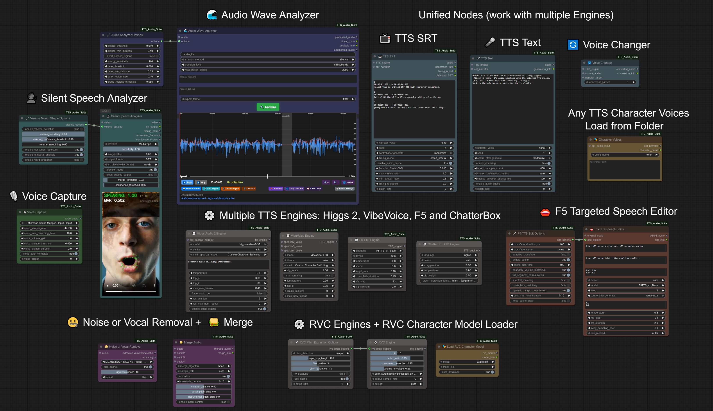
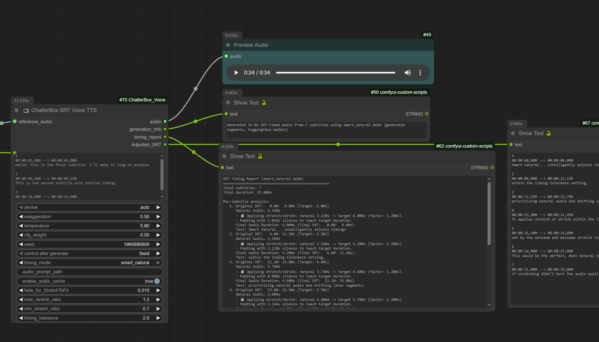

<a id="readme-top"></a>

[](https://discord.gg/EwKE8KBDqD)
[![Stargazers][stars-shield]][stars-url]
[![Issues][issues-shield]][issues-url]
[![Forks][forks-shield]][forks-url]
[![Dynamic TOML Badge][version-shield]][version-url]
[](https://ko-fi.com/diogogo)

# TTS Audio Suite v4.11.9

[](https://ko-fi.com/diogogo)

*Universal multi-engine TTS extension for ComfyUI - evolved from the original [ChatterBox Voice project](https://github.com/diodiogod/ComfyUI_ChatterBox_SRT_Voice).*

<div align="center">
  
</div>

A comprehensive ComfyUI extension providing unified Text-to-Speech and Voice Conversion capabilities through multiple engines including ChatterboxTTS, F5-TTS, Higgs Audio 2, and RVC (Real-time Voice Conversion), with modular architecture designed for extensibility and future engine integrations.

## 🚀 Project Evolution Timeline

```
🎭 ChatterBox Voice Era                     🌟 Multi-Engine Era
|                                                      |        
v1.0 ───────────► v1.1 ────────► v2.0 ──────────► v3.0 ─────────┐
Jun 25            Jun 25         Jun 25           Jul 25        │
│                 │              │                │             │
Foundation        SRT            Modular          F5-TTS +      │
ChatterBox        Subtitles      Structure        Audio         │
Voice Cloning     Timing Node    Refactor         Analyzer      │
                                                                ▼
v3.4 ◄──────────────── v3.2 ◄──────────────── v3.1 ◄────────────┘
Jul 25                 Jul 25                 Jul 25             
│                      │                      │                  
Language               Pause                  Character          
Switching              Tags                   Switching          
[German:Bob]           [pause:1s]             [Alice]            
│                                                  
│         ⚙️ TTS Audio Suite Era                                
▼         |                                   
v4.0 ──────────► v4.3 ──────────► v4.4 ────────► v4.5 ──────────┐
Aug 25           Aug 25           Aug 25         Aug 25         │
│                │                │              │              │
BREAKING!        RVC +            Silent         Higgs Audio 2  │
Project          Voice            Speech         New TTS Engine │
Renamed          Conversion       Analyzer       Voice Cloning  │
TTS Audio Suite  + Streaming                                    │
                                                                ▼
       v4.9 ◄─────────── v4.8 ◄─────────────── v4.6 ◄───────────┘
       Sep 25            Sep 25                Aug 25
       │                 │                     │
       IndexTTS-2        Chatterbox            VibeVoice
       Emotion           Multilingual          New TTS Engine
       Control           Official (23-lang)    90min Generation
```

<details>
<summary><h2>📋 Table of Contents</h2></summary>

- [🎥 Demo Videos](#-demo-videos)
- [Features](#features)
- [🆕 What's New in my Project?](#-whats-new-in-my-project)
  - [SRT Timing and TTS Node](#srt-timing-and-tts-node)
  - [🆕 F5-TTS Integration and 🆕 Audio Analyzer](#-f5-tts-integration-and--audio-analyzer)
  - [🗣️ Silent Speech Analyzer](#️-silent-speech-analyzer)
  - [🎭 Character & Narrator Switching](#-character--narrator-switching)
  - [🌍 Language Switching with Bracket Syntax](#-language-switching-with-bracket-syntax)
  - [🔄 Iterative Voice Conversion](#-iterative-voice-conversion)
  - [🎵 RVC Voice Conversion Integration](#-rvc-voice-conversion-integration)
  - [⏸️ Pause Tags System](#️-pause-tags-system)
  - [🌍 Multi-language ChatterBox Community Models](#-multi-language-chatterbox-community-models)
  - [🌐 Chatterbox Multilingual TTS (Official 23-Lang)](#-chatterbox-multilingual-tts-official-23-lang)
  - [⚙️ Universal Streaming Architecture](#️-universal-streaming-architecture)
  - [🎙️ Higgs Audio 2 Voice Cloning](#️-higgs-audio-2-voice-cloning)
  - [🎵 VibeVoice Long-Form Generation](#-vibevoice-long-form-generation)
  - [🌈 IndexTTS-2 With Emotion Control](#-indextts-2-with-emotion-control)
  - [📝 Phoneme Text Normalizer](#-phoneme-text-normalizer)
- [🚀 Quick Start](#-quick-start)
- [Installation](#installation)
  - [Prerequisites](#prerequisites)
  - [Installation Methods](#installation-methods)
  - [Troubleshooting Dependency Issues](#troubleshooting-dependency-issues)
  - [Updating the Node](#updating-the-node)
- [Enhanced Features](#enhanced-features)
- [Usage](#usage)
  - [Voice Recording](#voice-recording)
  - [Enhanced Text-to-Speech](#enhanced-text-to-speech)
  - [F5-TTS Voice Synthesis](#f5-tts-voice-synthesis)
  - [Voice Conversion with Iterative Refinement](#voice-conversion-with-iterative-refinement)
- [📁 Example Workflows](#-example-workflows)
- [Settings Guide](#settings-guide)
- [Text Processing Capabilities](#text-processing-capabilities)
- [License](#license)
- [Credits](#credits)
- [🔗 Links](#-links)

</details>

## 🎥 Demo Videos

<div align="center">
  <a href="https://youtu.be/aHz1mQ2bvEY">
    
  </a>
  <br>
  <strong><a href="https://youtu.be/aHz1mQ2bvEY">▶️ v3.2 Features Overview (20min) - F5-TTS Integration, Speech Editor & More!</a></strong>
</div>

<br>

<div align="center">
  <a href="https://youtu.be/VyOawMrCB1g?si=7BubljRhsudGqG3s">
    
  </a>
  <br>
  <strong><a href="https://youtu.be/VyOawMrCB1g?si=7BubljRhsudGqG3s">▶️ Original Demo - SRT Timing & Basic Features</a></strong>
</div>

<details>
<summary><h3>📜 Original ShmuelRonen ChatterBox TTS Nodes</h3></summary>

<div align="center">
  
  
</div>

* **Voice Recording**: Smart silence detection for voice capture
* **Enhanced Chunking**: Intelligent text splitting with multiple combination methods
* **Unlimited Text Length**: No character limits with smart processing

**Original creator:** [ShmuelRonen](https://github.com/ShmuelRonen/ComfyUI_ChatterBox_Voice)

</details>

<div align="right"><a href="#-table-of-contents">Back to top</a></div>

## Features

- 🎤 **Multi-Engine TTS** - ChatterBox TTS, **Chatterbox Multilingual TTS**, F5-TTS, Higgs Audio 2, VibeVoice, and **IndexTTS-2** with voice cloning, reference audio synthesis, and production-grade quality
- 🔄 **Voice Conversion** - ChatterBox VC with iterative refinement + RVC real-time conversion using .pth character models  
- 🎙️ **Voice Capture & Recording** - Smart silence detection and voice input recording
- 🎭 **Character & Language Switching** - Multi-character TTS with `[CharacterName]` tags, alias system, and `[language:character]` syntax for seamless model switching
- 🌍 **Multi-language Support** - **Chatterbox Multilingual TTS (Arabic, Danish, German, Greek, English, Spanish, Finnish, French, Hebrew, Hindi, Italian, Japanese, Korean, Malay, Dutch, Norwegian, Polish, Portuguese, Russian, Swedish, Swahili, Turkish, Chinese)** + ChatterBox community models (English, German, Italian, French, Russian, Armenian, Georgian, Japanese, Korean, Norwegian) + F5-TTS (English, German, Spanish, French, Japanese, Hindi, and more)
- 📝 **Multilingual Text Processing** - Universal Phoneme Text Normalizer with IPA phonemization, Unicode decomposition, and character mapping for improved pronunciation quality across languages (Experimental)
- 😤 **Emotion Control** - ChatterBox exaggeration parameter for expressive speech + IndexTTS-2 advanced emotion control with dynamic text analysis, character tags, and 8-emotion vectors → **[📖 IndexTTS-2 Guide](docs/IndexTTS2_Emotion_Control_Guide.md)**
- 📝 **Enhanced Chunking** - Intelligent text splitting for long content with multiple combination methods
- 🎵 **Advanced Audio Processing** - Optional FFmpeg support for premium audio quality with graceful fallback
- 🤐 **Vocal/Noise Removal** - AI-powered vocal separation, noise reduction, and echo removal with GPU acceleration → **[📖 Complete Guide](docs/VOCAL_REMOVAL_GUIDE.md)**
- 🌊 **Audio Wave Analyzer** - Interactive waveform visualization and precise timing extraction for F5-TTS workflows → **[📖 Complete Guide](docs/🌊_Audio_Wave_Analyzer-Complete_User_Guide.md)**
- 🗣️ **Silent Speech Analyzer** - Video analysis with experimental viseme detection, mouth movement tracking, and base SRT timing generation from silent video using MediaPipe
- ⚙️ **Parallel Processing** - Configurable worker-based processing via `batch_size` parameter (Note: sequential processing with `batch_size=0` remains optimal for performance)

<div align="right"><a href="#-table-of-contents">Back to top</a></div>

<details>
<summary><h2>🆕 What's New in my Project? (click to expand)</h2></summary>

<details>
<summary><h3>📺 SRT Timing and TTS Node</h3></summary>



The **"ChatterBox SRT Voice TTS"** node allows TTS generation by processing SRT content (SubRip Subtitle) files, ensuring precise timing and synchronization with your audio.

**Key SRT Features:**

* **SRT style Processing**: Uses SRT style to generate TTS, aligning audio with subtitle timings
* **`smart_natural` Timing Mode**: Intelligent shifting logic that prevents overlaps and ensures natural speech flow
* **`Adjusted_SRT` Output**: Provides actual timings for generated audio for accurate post-processing
* **Segment-Level Caching**: Only regenerates modified segments, significantly speeding up workflows

For comprehensive technical information, refer to the [SRT_IMPLEMENTATION.md](docs/Dev%20reports/SRT_IMPLEMENTATION.md) file.

</details>

<details>
<summary><h3>🆕 F5-TTS Integration and 🆕 Audio Analyzer</h3></summary>


* **F5-TTS Voice Synthesis**: High-quality voice cloning with reference audio + text
* **Audio Wave Analyzer**: Interactive waveform visualization for precise timing extraction
* **Multi-language Support**: English, German, Spanish, French, Japanese models
* **Speech Editing Workflows**: Advanced F5-TTS editing capabilities

</details>

<details>
<summary><h3>🗣️ Silent Speech Analyzer</h3></summary>

**NEW in v4.4.0**: Video analysis and mouth movement detection for silent video processing!

* **Mouth Movement Analysis**: Real-time detection of mouth shapes and movements from video
* **Experimental Viseme Classification**: Approximate detection of vowels (A, E, I, O, U) and consonants (B, F, M, etc.) - results are experimental approximations, not precise
* **3-Level Analysis System**:
  - Frame-level mouth movement detection
  - Syllable grouping with temporal analysis  
  - Word prediction using CMU Pronouncing Dictionary (135K+ words)
* **Base SRT Generation**: Creates timing-focused SRT files with start/end speech timing as foundation for user editing
* **MediaPipe Integration**: Production-ready analysis using Google's MediaPipe framework
* **Visual Feedback**: Preview videos with overlaid detection results
* **Automatic Phonetic Placeholders**: Word predictions provide phonetically-sensible placeholders, but phrases require user editing for meaningful content
* **TTS Integration**: SRT output designed for use with TTS SRT nodes after manual content editing

**Perfect for:**

- Creating base timing templates from silent video footage
- Animation and VFX reference timing
- Foundation for manual subtitle creation

**Important Notes**: 

- OpenSeeFace provider is experimental and not recommended for production use - MediaPipe is the stable solution
- Viseme detection is experimental approximation - expect to manually edit both timing and content
- Generated text placeholders are phonetic suggestions, not meaningful sentences

</details>

<details>
<summary><h3>🎙️ Higgs Audio 2 Voice Cloning</h3></summary>

**NEW in v4.5.0**: State-of-the-art voice cloning technology with advanced neural voice replication!

* **High-Quality Voice Cloning**: Clone any voice from 30+ second reference audio with exceptional fidelity
* **Multi-Speaker Conversations**: Native support for character switching within conversations
* **Real-Time Processing**: Generate speech in cloned voices with minimal latency
* **Universal Integration**: Works seamlessly with existing TTS Text and TTS SRT nodes

**Key Capabilities:**

- **Voice Cloning from Reference Audio**: Upload any 30+ second audio file for voice replication
- **Multi-Language Support**: English (tested), with potential support for Chinese, Korean, German, and Spanish (based on model training data)
- **Character Switching**: Use `[CharacterName]` syntax for multi-speaker dialogues
- **Advanced Generation Control**: Fine-tune temperature, top-p, top-k, and token limits
- **Smart Chunking**: Automatic handling of unlimited text length with seamless audio combination
- **Intelligent Caching**: Instant regeneration of previously processed content

**Technical Features:**

- **Modular Architecture**: Clean integration with unified TTS system
- **Automatic Model Management**: Downloads and organizes models in `ComfyUI/models/TTS/HiggsAudio/` structure
- **Progress Tracking**: Real-time generation feedback with tqdm progress bars
- **Voice Reference Discovery**: Flexible voice file management system

**Quick Start:**

1. Add `Higgs Audio Engine` node to configure voice cloning parameters
2. Connect to `TTS Text` or `TTS SRT` node for generation
3. Specify reference audio file or use voice discovery system
4. Generate high-quality cloned speech with automatic optimization

**Perfect for:**

- Voice acting and character dialogue creation
- Audiobook narration with consistent voice characteristics
- Multi-speaker content with distinct voice personalities
- Professional voice replication for content creation

</details>

<details>
<summary><h3>🎵 VibeVoice Long-Form Generation</h3></summary>

**NEW in v4.6.0**: Microsoft VibeVoice engine for unprecedented long-form audio generation!

* **90-Minute Generation Capability**: Generate up to 90 minutes of continuous audio in a single session
* **Dual Multi-Speaker Modes**: Choose between Custom Character Switching and Native Multi-Speaker for different workflow needs
* **Microsoft Quality**: Official Microsoft VibeVoice models (1.5B and 7B parameter variants) with production-grade output
* **Advanced Parameter Control**: CFG scale, sampling modes, temperature, and token limits for fine-tuned generation

**Key Capabilities:**

- **Long-Form Audio**: Break through traditional TTS length limitations with 90-minute generation
- **Custom Character Switching**: Use `[Alice]`, `[Bob]` character tags with voice files from the voices folder - supports unlimited characters with pause tags and per-character control
- **Native Multi-Speaker**: Efficient single-pass generation supporting both `[Character]` tag auto-conversion and manual "Speaker 1: Hello" format for up to 4 speakers  
- **Voice File Integration**: Seamless compatibility with existing voice folder structure and Character Voices node
- **Smart Chunking**: Automatic text chunking with configurable time-based limits for memory efficiency
- **Priority System**: Connected speaker2/3/4_voice inputs override character aliases with intelligent warnings

**Technical Features:**

- **Dual Model Support**: Microsoft vibevoice-1.5B (2.7B params, faster) and community vibevoice-7B (9.3B params, higher quality)
- **Intelligent Caching**: Advanced caching system with mode-aware invalidation for instant regeneration
- **Memory Optimization**: Configurable chunking system balances quality with memory usage
- **Unified Architecture**: Seamless integration with existing TTS Text and TTS SRT nodes

**Quick Start:**

1. Add `⚙️ VibeVoice Engine` node to configure model and multi-speaker mode  
2. Connect to `TTS Text` or `TTS SRT` node for generation
3. Choose between Custom Character Switching (recommended) or Native Multi-Speaker mode
4. Generate long-form content with automatic voice cloning from your voices folder

**Perfect for:**

- Long-form audiobooks and narration with consistent voice quality
- Multi-character dialogue and conversations with distinct speaker voices  
- Extended podcast-style content with natural speech patterns
- Educational content requiring extended generation without quality degradation

</details>

<details>
<summary><h3>🎭 Character & Narrator Switching</h3></summary>

**NEW in v3.1.0**: Seamless character switching for both F5TTS and ChatterBox engines!

* **Multi-Character Support**: Use `[CharacterName]` tags to switch between different voices
* **Voice Folder Integration**: Organized character voice management system
* **🏷️ Character Aliases**: User-friendly alias system - use `[Alice]` instead of `[female_01]` with `#character_alias_map.txt`
* **Robust Fallback**: Graceful handling when characters not found (no errors!)
* **Universal Compatibility**: Works with both F5TTS and ChatterBox TTS engines
* **SRT Integration**: Character switching within subtitle timing
* **Backward Compatible**: Existing workflows work unchanged

**📖 [Complete Character Switching Guide](docs/CHARACTER_SWITCHING_GUIDE.md)**

Example usage:

```
Hello! This is the narrator speaking.
[Alice] Hi there! I'm Alice, nice to meet you.
[Bob] And I'm Bob! Great to meet you both.
Back to the narrator for the conclusion.
```

</details>

<details>
<summary><h3>🌍 Language Switching with Bracket Syntax</h3></summary>

**NEW in v3.4.0**: Seamless language switching using simple bracket notation!

* **Language Code Syntax**: Use `[language:character]` tags to switch languages and models automatically
* **Smart Model Loading**: Automatically loads correct language models (F5-DE, F5-FR, German, Norwegian, etc.)
* **Flexible Aliases** *(v3.4.3)*: Support for `[German:Alice]`, `[Brazil:Bob]`, `[USA:]`, `[Portugal:]` - no need to remember language codes!
* **Standard Format**: Also supports traditional `[fr:Alice]`, `[de:Bob]`, or `[es:]` (language only) patterns
* **Character Integration**: Combines perfectly with character switching and alias system
* **Performance Optimized**: Language groups processed efficiently to minimize model switching
* **Alias Support**: Language defaults work with character alias system

**Supported Languages:**

* **F5-TTS**: English (en), German (de), Spanish (es), French (fr), Italian (it), Japanese (jp), Thai (th), Portuguese (pt), Hindi (hi)
* **ChatterBox**: English (en), German (de, de-best, de-expressive), Italian (it), French (fr), Russian (ru), Armenian (hy), Georgian (ka), Japanese (ja), Korean (ko), Norwegian (no/nb/nn)

Example usage:

```
Hello! This is English text with the default model.
[de:Alice] Hallo! Ich spreche Deutsch mit Alice's Stimme.
[fr:] Bonjour! Je parle français avec la voix du narrateur.
[es:Bob] ¡Hola! Soy Bob hablando en español.
Back to English with the original model.
```

**Advanced SRT Integration:**

```srt
1
00:00:01,000 --> 00:00:04,000
Hello! Welcome to our multilingual show.

2
00:00:04,500 --> 00:00:08,000
[de:female_01] Willkommen zu unserer mehrsprachigen Show!

3
00:00:08,500 --> 00:00:12,000
[fr:] Bienvenue à notre émission multilingue!
```

</details>

<details>
<summary><h3>🔄 Iterative Voice Conversion</h3></summary>

**NEW**: Progressive voice refinement with intelligent caching for instant experimentation!

* **Refinement Passes**: Multiple conversion iterations (1-30, recommended 1-5)
* **Smart Caching**: Results cached up to 5 iterations - change from 5→3→4 passes instantly
* **Progressive Quality**: Each pass refines output to sound more like target voice

</details>

<details>
<summary><h3>🎵 RVC Voice Conversion Integration</h3></summary>

**NEW in v4.1.0**: Professional-grade Real-time Voice Conversion with .pth character models!

* **RVC Character Models**: Load .pth voice models with 🎭 Load RVC Character Model node
* **Unified Voice Changer**: Full RVC integration in the Voice Changer node
* **Iterative Refinement**: 1-30 passes with smart caching (like ChatterBox)
* **Enhanced Quality**: Automatic .index file loading for improved voice similarity
* **Auto-Download**: Required models download from official sources automatically
* **Cache Intelligence**: Skip recomputation - change 5→3→4 passes instantly
* **Neural Network Quality**: High-quality voice conversion using trained RVC models

📖 **See [RVC Models Setup](#7-rvc-models-optional---new-in-v400) for detailed installation guide**

**How it works:**

1. Load your .pth RVC model with 🎭 Load RVC Character Model
2. Connect to 🔄 Voice Changer, select "RVC" engine
3. Process with iterative refinement for progressive quality improvement
4. Results cached for instant experimentation with different pass counts

</details>

<details>
<summary><h3>⏸️ Pause Tags System</h3></summary>

**NEW**: Intelligent pause insertion for natural speech timing control!

* **Smart Pause Syntax**: Use pause tags anywhere in your text with multiple aliases
* **Flexible Duration Formats**: 
  - Seconds: `[pause:1.5]`, `[wait:2s]`, `[stop:3]`
  - Milliseconds: `[pause:500ms]`, `[wait:1200ms]`, `[stop:800ms]`
  - Supported aliases: `pause`, `wait`, `stop` (all work identically)
* **Character Integration**: Pause tags work seamlessly with character switching
* **Intelligent Caching**: Changing pause durations won't regenerate unchanged text segments
* **Universal Support**: Works across all TTS nodes (ChatterBox, F5-TTS, SRT)
* **Automatic Processing**: No additional parameters needed - just add tags to your text

Example usage:

```
Welcome to our show! [pause:1s] Today we'll discuss exciting topics.
[Alice] I'm really excited! [wait:500ms] This will be great.
[stop:2] Let's get started with the main content.
```

</details>

<details>
<summary><h3>🌍 Multi-language ChatterBox Community Models</h3></summary>

**NEW in v4.6.29**: ChatterBox TTS now supports 11 languages with community-finetuned models and automatic model management!

**Supported Languages:**

- 🇺🇸 **English**: Original ResembleAI model (default)
- 🇩🇪 **German**: Three variants available:
  - Standard German (stlohrey/chatterbox_de)
  - German Best (havok2) - Multi-speaker hybrid, best quality
  - German Expressive (SebastianBodza) - Emotion control with `<haha>`, `<wow>` tags
- 🇮🇹 **Italian**: Bilingual Italian/English model with `[it]` prefix for Italian text
- 🇫🇷 **French**: 1,400 hours Emilia dataset with zero-shot voice cloning
- 🇷🇺 **Russian**: Complete model with training artifacts
- 🇦🇲 **Armenian**: Complete model with unique architecture
- 🇬🇪 **Georgian**: Complete model with specialized features
- 🇯🇵 **Japanese**: Uses shared English components with Japanese text processing
- 🇰🇷 **Korean**: Uses shared English components with Korean text processing
- 🇳🇴 **Norwegian**: Norwegian ChatterBox model (akhbar/chatterbox-tts-norwegian)

**Key Features:**

* **Language Dropdown**: Simple language selection in all ChatterBox nodes
* **Auto-Download**: Models download automatically on first use (~1GB per language)
* **Local Priority**: Prefers locally installed models over downloads for offline use
* **Safetensors Support**: Modern format support for newer language models
* **Seamless Integration**: Works with existing workflows - just select your language

**Usage**: Select language from dropdown → First generation downloads model → Subsequent generations use cached model

</details>

<details>
<summary><h3>🌐 Chatterbox Multilingual TTS (Official 23-Lang)</h3></summary>

**NEW in v4.8.0**: Official ResembleAI Chatterbox Multilingual TTS model with native support for 23 languages!

The **Chatterbox Multilingual TTS** (referred to internally as "ChatterBox Official 23-Lang" to distinguish from community models) is ResembleAI's first production-grade open-source TTS model supporting 23 languages out of the box. This is the official successor to the original ChatterBox model with enhanced multilingual capabilities.

**🎯 Key Advantages over Community Models:**

* **Single Unified Model**: One model handles all 23 languages - no model switching required
* **Language Parameter Switching**: Changes language via parameter, not model loading (faster)
* **Zero-Shot Voice Cloning**: Clone any voice with just a few seconds of reference audio across all languages
* **Production-Grade Quality**: Benchmarked against leading closed-source systems like ElevenLabs
* **MIT Licensed**: Fully open-source with commercial usage rights
* **Perth Watermarking**: Built-in responsible AI usage (disabled by default for compatibility)

**🌍 Supported Languages (23 total):**

Arabic (ar), Danish (da), German (de), Greek (el), English (en), Spanish (es), Finnish (fi), French (fr), Hebrew (he), Hindi (hi), Italian (it), Japanese (ja), Korean (ko), Malay (ms), Dutch (nl), Norwegian (no), Polish (pl), Portuguese (pt), Russian (ru), Swedish (sv), Swahili (sw), Turkish (tr), Chinese (zh)

**🔧 Fully Integrated Features:**

* ✅ **Character Switching**: Full `[CharacterName]` support with per-character voice references
* ✅ **Language Switching**: `[language:character]` syntax with intelligent parameter switching
* ✅ **Pause Tags**: Complete `[pause:Ns]` support with character voice inheritance  
* ✅ **SRT Processing**: Advanced subtitle timing with overlapping modes and audio assembly
* ✅ **Voice Conversion**: Built-in VC engine supporting all 23 languages
* ✅ **Emotion Control**: Unique exaggeration parameter for expressive speech
* ✅ **Advanced Parameters**: Full control over repetition_penalty, min_p, top_p for fine-tuning
* ✅ **Cache Invalidation**: Proper parameter-based caching for responsive generation

**🆚 vs Community Models:**

| Feature | Chatterbox Multilingual TTS | Community Models |
|---------|----------------------------|------------------|
| Languages | 23 native languages | 11 finetuned variants |
| Model Loading | Single model, parameter switching | Separate model per language |
| Voice Cloning | Zero-shot across all languages | Per-model training |
| Official Support | ✅ ResembleAI official | Community maintained |
| Character Integration | ✅ Full integration | ✅ Full integration |
| SRT Support | ✅ Advanced timing modes | ✅ Advanced timing modes |
| Performance | Optimized single-model | Multiple model overhead |

**🎭 Character Example:**
```
[En:Alice] Hello everyone! [De:Hans] Guten Tag! [Es:Maria] ¡Hola! [pause:2s] [En:Alice] That was amazing multilingual switching!
```

This creates seamless multilingual character switching with proper voice inheritance and pause support - all within a single model.

**🎭 NEW: v2 Special Emotion & Sound Tokens** 🚧 *Experimental*

ChatterBox v2 vocabulary includes 30+ special tokens for emotions, sounds, and vocal effects. **Note: These are experimental - tokens may produce minimal or no audible effects.** ResembleAI has not officially documented their usage ([see issue #186](https://github.com/resemble-ai/chatterbox/issues/186)).

Try angle brackets `<emotion>` to experiment:

```
[Alice] Hello! <laughter> hahaha. [pause:0.5] <whisper> This might work slightly.
```

**Available v2 Tokens:**
- **Emotions**: `<giggle>`, `<laughter>`, `<sigh>`, `<cry>`, `<gasp>`, `<groan>`
- **Speech Modifiers**: `<whisper>`, `<mumble>`, `<singing>`, `<humming>`
- **Sounds**: `<cough>`, `<sneeze>`, `<sniff>`, `<inhale>`, `<exhale>`
- **And more!** See the **[📖 Complete v2 Special Tokens Guide](docs/CHATTERBOX_V2_SPECIAL_TOKENS.md)** for all 30+ tokens

**Model Version Selection:**
- **v2** (default): Enhanced tokenization with experimental emotion/sound tokens
- **v1**: Original model without special tokens

Both versions fully support character switching, language switching, and pause tags. The v2 special tokens are **experimental with limited effectiveness** - our implementation is ready for when/if ResembleAI improves this feature. The angle bracket syntax `<emotion>` avoids conflicts with character tags `[Name]` and pause tags `[pause:1s]`.

</details>

<details>
<summary><h3>⚙️ Universal Streaming Architecture</h3></summary>

**NEW in v4.3.0**: Complete architectural overhaul implementing universal streaming system with parallel processing capabilities!

**Key Features:**

* **Universal Streaming Infrastructure**: Unified processing system eliminating engine-specific code complexity
* **Parallel Processing**: Configurable worker-based processing via `batch_size` parameter
* **Thread-Safe Design**: Stateless wrapper architecture eliminates shared state corruption
* **Future-Proof**: New engines require only adapter implementation

**Performance Notes:**

* **Sequential Recommended**: Use `batch_size=0` for optimal performance (sequential processing)
* **Parallel Available**: `batch_size > 1` enables parallel workers but typically slower due to GPU inference characteristics
* **Memory Efficiency**: Improved model sharing prevents memory exhaustion when switching modes

→ **[📖 Read Technical Details](docs/Dev%20reports/POST_V4.2.3_DEVELOPMENT_REVIEW.md)**

</details>

<details>
<summary><h3>🌈 IndexTTS-2 With Emotion Control</h3></summary>

**NEW in v4.9.0**: Revolutionary IndexTTS-2 engine with advanced emotion control and unified emotion architecture!

* **Unified Emotion Control**: Single `emotion_control` input supporting multiple emotion methods with intelligent priority system
* **Dynamic Text Emotion**: AI-powered QwenEmotion analysis with dynamic `{seg}` template processing for contextual per-segment emotions
* **Direct Audio Reference**: Use any audio file as emotion reference for natural emotional expression
* **Character Voices Integration**: Use Character Voices `opt_narrator` output as emotion reference with automatic detection
* **8-Emotion Vector Control**: Manual precision control over Happy, Angry, Sad, Surprised, Afraid, Disgusted, Calm, and Melancholic emotions
* **Character Tag Emotions**: Per-character emotion control using `[Character:emotion_ref]` syntax (highest priority)
* **Emotion Alpha Control**: Fine-tune emotion intensity from 0.0 (neutral) to 2.0 (maximum dramatic expression)

**Key Features:**

- **Emotion Priority System**: Character tags > Global emotion control with intelligent override handling
- **Dynamic Templates**: Use `{seg}` placeholder for contextual emotion analysis (e.g., "Worried parent speaking: {seg}")
- **Universal Compatibility**: Works with existing TTS Text and TTS SRT nodes seamlessly
- **Advanced Caching**: Stable audio content hashing for reliable cache hits across sessions
- **QwenEmotion Integration**: State-of-the-art text emotion analysis with configurable model selection

**Example Usage:**

```text
Welcome to our show! [Alice:happy_sarah] I'm so excited to be here!
[Bob:angry_narrator] That's completely unacceptable behavior.
```

**Perfect for:**

- Multi-character dialogue with individual emotional expressions
- Dynamic storytelling with contextual emotion adaptation
- Professional voice acting with precise emotional control
- Content creation requiring sophisticated emotional nuance

**📖 [Complete IndexTTS-2 Emotion Control Guide](docs/IndexTTS2_Emotion_Control_Guide.md)**

</details>

<details>
<summary><h3>📝 Phoneme Text Normalizer</h3></summary>

**NEW in v4.10.0**: Universal multilingual text preprocessing node for improved TTS pronunciation quality across languages!

* **📝 Phoneme Text Normalizer Node**: Standalone text processing node with multiple normalization methods
* **🌍 Universal Language Support**: Handles special characters for Polish, German, French, Spanish, Czech, Nordic languages, and more
* **🔄 Multiple Processing Methods**:
  - **Pass-through**: No processing (original text)
  - **Unicode Decomposition**: Converts special characters to base + diacritical marks
  - **IPA Phonemization**: Full International Phonetic Alphabet conversion using espeak
  - **Character Mapping**: ASCII fallback for maximum compatibility
* **🧠 Auto-Language Detection**: Automatically detects input language based on character patterns
* **🖥️ Cross-Platform Support**: Works on Windows (espeak-phonemizer-windows), Linux/Mac (phonemizer + system espeak)
* **🔗 Engine Integration**: Compatible with all TTS engines - F5-TTS, ChatterBox, Higgs Audio 2, VibeVoice, IndexTTS-2

**Perfect for:**
- Improving Polish, German, French pronunciation in F5-TTS
- Processing multilingual content with special characters
- Standardizing text input across different TTS engines
- Converting text to phonemic representation for better synthesis

> **⚠️ Experimental Feature**: This is a new experimental feature - user feedback needed to validate pronunciation improvements across different languages. Please test with your target languages and report results!

**📖 Try the workflow**: [F5 TTS integration + 📝 Phoneme Text Normalizer](example_workflows/F5%20TTS%20integration%20+%20📝%20Phoneme%20Text%20Normalizer.json)

</details>

</details>

## 🚀 Quick Start

### Option 1: ComfyUI Manager (Recommended) ✨

**One-click installation with intelligent dependency management:**

1. Use ComfyUI Manager to install **"TTS Audio Suite"**
2. **That's it!** ComfyUI Manager automatically runs our install.py script which handles:
   - ✅ **Python 3.13 compatibility** (MediaPipe → OpenSeeFace fallback)
   - ✅ **Dependency conflicts** (NumPy, librosa, etc.)
   - ✅ **All bundled engines** (ChatterBox, F5-TTS, Higgs Audio)
   - ✅ **RVC voice conversion** dependencies
   - ✅ **Intelligent conflict resolution** with --no-deps handling

**Python 3.13 Support:**

- 🟢 **All TTS engines**: ChatterBox, F5-TTS, Higgs Audio ✅ Working
- 🟢 **RVC voice conversion**: ✅ Working  
- 🟢 **OpenSeeFace mouth movement**: ✅ Working (experimental)
- 🔴 **MediaPipe mouth movement**: ❌ Incompatible (use OpenSeeFace)

### Option 2: Manual Installation

**Same intelligent installer, manual setup:**

1. **Clone the repository**
   
   ```bash
   cd ComfyUI/custom_nodes
   git clone https://github.com/diodiogod/TTS-Audio-Suite.git
   cd TTS-Audio-Suite
   ```

2. **Run the intelligent installer:**
   
   **ComfyUI Portable:**
   
   ```bash
   # Windows:
   ..\..\..\python_embeded\python.exe install.py
   
   # Linux/Mac:
   ../../../python_embeded/python.exe install.py
   ```
   
   **ComfyUI with venv/conda:**
   
   ```bash
   # First activate your ComfyUI environment, then:
   python install.py
   ```
   
   The installer automatically handles all dependency conflicts and Python version compatibility.

3. **Manual Download Models** (OR It will auto-download on first run)
   
   - Download from [HuggingFace ChatterBox](https://huggingface.co/ResembleAI/chatterbox/tree/main)
   - Place in `ComfyUI/models/TTS/chatterbox/English/` (recommended) or `ComfyUI/models/chatterbox/` (legacy)

4. **Try a Workflow**
   
   - Download: [ChatterBox Integration Workflow](example_workflows/Chatterbox%20integration.json)
   - Drag into ComfyUI and start generating!

5. **Restart ComfyUI** and look for 🎤 TTS Audio Suite nodes

> **🧪 Python 3.13 Users**: Installation is fully supported! The system automatically uses OpenSeeFace for mouth movement analysis when MediaPipe is unavailable.

> **Need F5-TTS?** Also download F5-TTS models to `ComfyUI/models/F5-TTS/` from the links in the detailed installation below.

<div align="right"><a href="#-table-of-contents">Back to top</a></div>

## Installation

<details>
<summary>📋 Detailed Installation Guide (Click to expand if you're having dependency issues)</summary>

This section provides a detailed guide for installing TTS Audio Suite, covering different ComfyUI installation methods.

### Prerequisites

* ComfyUI installation (Portable, Direct with venv, or through Manager)

* Python 3.12 or higher

* **System libraries** (Linux only):
  
  ```bash
  # Ubuntu/Debian - Required for audio processing
  sudo apt-get install portaudio19-dev libsamplerate0-dev
  
  # Fedora/RHEL
  sudo dnf install portaudio-devel libsamplerate-devel
  ```
  
  > **📋 Why needed?** `libsamplerate0-dev` provides audio resampling libraries for packages like `resampy` and `soxr`. `portaudio19-dev` enables voice recording features.

* **macOS dependencies**:
  
  ```bash
  brew install portaudio
  ```

* **Windows**: No additional system dependencies needed (libraries come pre-compiled)

### Installation Methods

#### 1. Portable Installation

For portable installations, follow these steps:

1. Clone the repository into the `ComfyUI/custom_nodes` folder:
   
   ```bash
   cd ComfyUI/custom_nodes
   git clone https://github.com/diodiogod/TTS-Audio-Suite.git
   ```

2. Navigate to the cloned directory:
   
   ```bash
   cd TTS-Audio-Suite
   ```

3. Install the required dependencies.  **Important:** Use the `python.exe` executable located in your ComfyUI portable installation with environment isolation flags.
   
   ```bash
   ../../../python_embeded/python.exe -m pip install -r requirements.txt --no-user
   ```
   
   **Why the `--no-user` flag?**
   
   - Prevents installing to your system Python's user directory, which can cause import conflicts
   - Ensures packages install only to the portable environment for proper isolation

#### 2. Direct Installation with venv

If you have a direct installation with a virtual environment (venv), follow these steps:

1. Clone the repository into the `ComfyUI/custom_nodes` folder:
   
   ```bash
   cd ComfyUI/custom_nodes
   git clone https://github.com/diodiogod/TTS-Audio-Suite.git
   ```

2. Activate your ComfyUI virtual environment.  This is crucial to ensure dependencies are installed in the correct environment. The method to activate the venv may vary depending on your setup.  Here's a common example:
   
   ```bash
   cd ComfyUI
   . ./venv/bin/activate
   ```
   
   or on Windows:
   
   ```bash
   ComfyUI\venv\Scripts\activate
   ```

3. Navigate to the cloned directory:
   
   ```bash
   cd custom_nodes/TTS-Audio-Suite
   ```

4. Install the required dependencies using `pip`:
   
   ```bash
   pip install -r requirements.txt
   ```

#### 3. Installation through the ComfyUI Manager

1. Install the ComfyUI Manager if you haven't already.

2. Use the Manager to install the "TTS Audio Suite" node.

3. The manager might handle dependencies automatically, but it's still recommended to verify the installation.  Navigate to the node's directory:
   
   ```bash
   cd ComfyUI/custom_nodes/TTS-Audio-Suite
   ```

4. Activate your ComfyUI virtual environment (see instructions in "Direct Installation with venv").

5. If you encounter issues, manually install the dependencies:
   
   ```bash
   pip install -r requirements.txt
   ```

### Troubleshooting Dependency Issues

#### System Dependencies (Linux)

**Our install script automatically detects missing system libraries** and will display helpful error messages like:

```
[!] Missing system dependencies detected!
============================================================
SYSTEM DEPENDENCIES REQUIRED
============================================================
• libsamplerate0-dev (for audio resampling)  
• portaudio19-dev (for voice recording)

Please install with:
# Ubuntu/Debian:
sudo apt-get install libsamplerate0-dev portaudio19-dev

# Fedora/RHEL:
sudo dnf install libsamplerate-devel portaudio-devel
============================================================
Then run this install script again.
```

#### Python Environment Issues

A common problem is installing dependencies in the wrong Python environment. Always ensure you are installing dependencies within your ComfyUI's Python environment.

* **Verify your Python environment:** After activating your venv or navigating to your portable ComfyUI installation, check the Python executable being used:
  
  ```bash
  which python
  ```
  
  This should point to the Python executable within your ComfyUI installation (e.g., `ComfyUI/python_embeded/python.exe` or `ComfyUI/venv/bin/python`).

* **If `s3tokenizer` fails to install:** This dependency can be problematic. Try upgrading your pip and setuptools:
  
  ```bash
  python -m pip install --upgrade pip setuptools wheel
  ```
  
  Then, try installing the requirements again.

* **If you cloned the node manually (without the Manager):** Make sure you install the requirements.txt file.

### Updating the Node

To update the node to the latest version:

1. Navigate to the node's directory:
   
   ```bash
   cd ComfyUI/custom_nodes/TTS-Audio-Suite
   ```

2. Pull the latest changes from the repository:
   
   ```bash
   git pull
   ```

3. Reinstall the dependencies (in case they have been updated):
   
   ```bash
   pip install -r requirements.txt
   ```

</details>

### 1. Clone Repository

```bash
cd ComfyUI/custom_nodes
git clone https://github.com/diodiogod/TTS-Audio-Suite.git
```

### 2. Install Dependencies

Some dependencies, particularly `s3tokenizer`, can occasionally cause installation issues on certain Python setups (e.g., Python 3.10, sometimes used by tools like Stability Matrix).

To minimize potential problems, it's highly recommended to first ensure your core packaging tools are up-to-date in your ComfyUI's virtual environment:

```bash
python -m pip install --upgrade pip setuptools wheel
```

After running the command above, install the node's specific requirements:

```bash
pip install -r requirements.txt
```

### 3. Optional: Install FFmpeg for Enhanced Audio Processing

ChatterBox Voice now supports FFmpeg for high-quality audio stretching. While not required, it's recommended for the best audio quality:

**Windows:**

```bash
winget install FFmpeg
# or with Chocolatey
choco install ffmpeg
```

**macOS:**

```bash
brew install ffmpeg
```

**Linux:**

```bash
# Ubuntu/Debian
sudo apt-get install ffmpeg

# Fedora
sudo dnf install ffmpeg
```

If FFmpeg is not available, ChatterBox will automatically fall back to using the built-in phase vocoder method for audio stretching - your workflows will continue to work without interruption.

### 4. Download Models

**Download the ChatterboxTTS models** and place them in the new organized structure:

```
ComfyUI/models/TTS/chatterbox/    ← Recommended (new structure)
```

Or use the legacy location (still supported):

```
ComfyUI/models/chatterbox/        ← Legacy (still works)
```

**Required files:**

- `conds.pt` (105 KB)
- `s3gen.pt` (~1 GB)
- `t3_cfg.pt` (~1 GB)
- `tokenizer.json` (25 KB)
- `ve.pt` (5.5 MB)

**Download from:** https://huggingface.co/ResembleAI/chatterbox/tree/main

#### 4.1. Multilanguage ChatterBox Models (Optional)

**NEW in v3.3.0**: ChatterBox now supports multiple languages! Models will auto-download on first use, or you can manually install them for offline use.

**For manual installation**, create language-specific folders in the organized structure:

```
ComfyUI/models/TTS/chatterbox/    ← Recommended structure
├── English/          # Optional - for explicit English organization
│   ├── conds.pt
│   ├── s3gen.pt
│   ├── t3_cfg.pt
│   ├── tokenizer.json
│   └── ve.pt
├── German/           # German language models
│   ├── conds.safetensors
│   ├── s3gen.safetensors
│   ├── t3_cfg.safetensors
│   ├── tokenizer.json
│   └── ve.safetensors
└── Norwegian/        # Norwegian language models
    ├── conds.safetensors
    ├── s3gen.safetensors
    ├── t3_cfg.safetensors
    ├── tokenizer.json
    └── ve.safetensors
```

> **Note**: Legacy location `ComfyUI/models/chatterbox/` still works for backward compatibility.

**Available ChatterBox Language Models:**

| Language                | HuggingFace Repository                                                                    | Format       | Auto-Download |
| ----------------------- | ----------------------------------------------------------------------------------------- | ------------ | ------------- |
| English                 | [ResembleAI/chatterbox](https://huggingface.co/ResembleAI/chatterbox)                     | .pt          | ✅             |
| German                  | [stlohrey/chatterbox_de](https://huggingface.co/stlohrey/chatterbox_de)                   | .safetensors | ✅             |
| German (havok2)         | [niobures/Chatterbox-TTS](https://huggingface.co/niobures/Chatterbox-TTS)                 | .safetensors | ✅             |
| German (SebastianBodza) | [niobures/Chatterbox-TTS](https://huggingface.co/niobures/Chatterbox-TTS)                 | .safetensors | ✅             |
| Italian                 | [niobures/Chatterbox-TTS](https://huggingface.co/niobures/Chatterbox-TTS)                 | .pt          | ✅             |
| French                  | [Thomcles/ChatterBox-fr](https://huggingface.co/Thomcles/ChatterBox-fr)                   | .safetensors | ✅             |
| Russian                 | [niobures/Chatterbox-TTS](https://huggingface.co/niobures/Chatterbox-TTS)                 | .safetensors | ✅             |
| Armenian                | [niobures/Chatterbox-TTS](https://huggingface.co/niobures/Chatterbox-TTS)                 | .safetensors | ✅             |
| Georgian                | [niobures/Chatterbox-TTS](https://huggingface.co/niobures/Chatterbox-TTS)                 | .safetensors | ✅             |
| Japanese                | [niobures/Chatterbox-TTS](https://huggingface.co/niobures/Chatterbox-TTS)                 | .safetensors | ✅             |
| Korean                  | [niobures/Chatterbox-TTS](https://huggingface.co/niobures/Chatterbox-TTS)                 | .safetensors | ✅             |
| Norwegian               | [akhbar/chatterbox-tts-norwegian](https://huggingface.co/akhbar/chatterbox-tts-norwegian) | .safetensors | ✅             |

**Usage:** Simply select your desired language from the dropdown in ChatterBox TTS or SRT nodes. First generation will auto-download the model.

### 4.2. Chatterbox Multilingual TTS (Official 23-Lang)

**Repository:** [ResembleAI/chatterbox](https://huggingface.co/ResembleAI/chatterbox) | **Size:** ~4.3GB | **Auto-Download:** ✅

The official ResembleAI multilingual model supporting 23 languages in a unified model structure.

**Installation Structure:**

All v1 and v2 files coexist in the same directory (they share most files):

```
ComfyUI/models/TTS/chatterbox_official_23lang/
└── ChatterBox Official 23-Lang/          # Single directory for both versions
    # v1 Model Files:
    ├── t3_23lang.safetensors             # Multilingual T3 model v1 (2.14GB)

    # v2 Model Files (auto-downloads when v2 selected):
    ├── t3_mtl23ls_v2.safetensors           # Multilingual T3 model v2 with enhanced tokenization (2.14GB)
    ├── grapheme_mtl_merged_expanded_v1.json # Enhanced grapheme/phoneme mappings with special tokens (68KB)

    # Shared Files (used by both v1 and v2):
    ├── s3gen.pt                 # S3Gen model (1.06GB)
    ├── ve.pt                    # Voice encoder (5.7MB)
    ├── mtl_tokenizer.json       # Multilingual tokenizer (68KB)
    └── conds.pt                 # Conditioning (107KB, optional)
```

**Model Selection:**
- Choose "ChatterBox Official 23-Lang" from Unified TTS Engine dropdown
- Select model version (v1 or v2) in the Engine Configuration node
- **Auto-download**: Missing v2 files download automatically on first use (only ~2.2GB if v1 already installed)
- Both versions can coexist - switch between them without re-downloading

### 5. F5-TTS Models (Optional)

**For F5-TTS voice synthesis capabilities**, download F5-TTS models and place them in the organized structure:

```
ComfyUI/models/TTS/F5-TTS/       ← Recommended (new structure)
```

Or use the legacy location (still supported):

```
ComfyUI/models/F5-TTS/           ← Legacy (still works)
```

**Available F5-TTS Models:**

| Model              | Language         | Download                                                                         | Size   |
| ------------------ | ---------------- | -------------------------------------------------------------------------------- | ------ |
| **F5TTS_Base**     | English          | [HuggingFace](https://huggingface.co/SWivid/F5-TTS/tree/main/F5TTS_Base)         | ~1.2GB |
| **F5TTS_v1_Base**  | English (v1)     | [HuggingFace](https://huggingface.co/SWivid/F5-TTS/tree/main/F5TTS_v1_Base)      | ~1.2GB |
| **E2TTS_Base**     | English (E2-TTS) | [HuggingFace](https://huggingface.co/SWivid/E2-TTS/tree/main/E2TTS_Base)         | ~1.2GB |
| **F5-DE**          | German           | [HuggingFace](https://huggingface.co/aihpi/F5-TTS-German)                        | ~1.2GB |
| **F5-ES**          | Spanish          | [HuggingFace](https://huggingface.co/jpgallegoar/F5-Spanish)                     | ~1.2GB |
| **F5-FR**          | French           | [HuggingFace](https://huggingface.co/RASPIAUDIO/F5-French-MixedSpeakers-reduced) | ~1.2GB |
| **F5-JP**          | Japanese         | [HuggingFace](https://huggingface.co/Jmica/F5TTS)                                | ~1.2GB |
| **F5-Hindi-Small** | Hindi            | [HuggingFace](https://huggingface.co/SPRINGLab/F5-Hindi-24KHz)                   | ~632MB |

**Vocoder (Optional but Recommended):**

```
ComfyUI/models/TTS/F5-TTS/vocos/     ← Recommended
├── config.yaml
├── pytorch_model.bin
└── vocab.txt
```

Legacy location also supported: `ComfyUI/models/F5-TTS/vocos/`

Download from: [Vocos Mel-24kHz](https://huggingface.co/charactr/vocos-mel-24khz)

**Complete Folder Structure (Recommended):**

```
ComfyUI/models/TTS/F5-TTS/
├── F5TTS_Base/
│   ├── model_1200000.safetensors    ← Main model file
│   └── vocab.txt                    ← Vocabulary file
├── vocos/                           ← For offline vocoder
│   ├── config.yaml
│   └── pytorch_model.bin
└── F5TTS_v1_Base/
    ├── model_1250000.safetensors
    └── vocab.txt
```

**Required Files for Each Model:**

- `model_XXXXXX.safetensors` - The main model weights
- `vocab.txt` - Vocabulary/tokenizer file (download from same HuggingFace repo)

**Note:** F5-TTS uses internal config files, no config.yaml needed. Vocos vocoder doesn't need vocab.txt.

**Note:** F5-TTS models and vocoder will auto-download from HuggingFace if not found locally. The first generation may take longer while downloading (~1.2GB per model).

### 6. F5-TTS Voice References Setup

**For easy voice reference management**, create a dedicated voices folder:

```
ComfyUI/models/voices/
├── character1.wav
├── character1.reference.txt ← Contains: "Hello, I am character one speaking clearly."
├── character1.txt          ← Contains: "BBC Radio sample, licensed under CC3..."
├── narrator.wav
├── narrator.txt            ← Contains: "This is the narrator voice for storytelling."
├── my_voice.wav
└── my_voice.txt            ← Contains: "This is my personal voice sample."
```

**Voice Reference Requirements:**

- **Audio files**: WAV format, 5-30 seconds, clean speech, 24kHz recommended
- **Text files**: Exact transcription of what's spoken in the audio file
- **Naming**: `filename.wav` + `filename.reference.txt` (preferred) or `filename.txt` (fallback)
- **Character Names**: Character name = audio filename (without extension). Subfolders supported for organization.

**⚠️ F5-TTS Best Practices**: [Follow these guidelines to avoid inference failures](#f5-tts-inference-guidelines)

<details>
<summary><strong>📋 F5-TTS Inference Guidelines</strong></summary>

To avoid possible inference failures, make sure you follow these F5-TTS optimization guidelines:

1. **Reference Audio Duration**: Use reference audio <12s and leave proper silence space (e.g. 1s) at the end. Otherwise there is a risk of truncating in the middle of word, leading to suboptimal generation.

2. **Letter Case Handling**: Uppercased letters (best with form like K.F.C.) will be uttered letter by letter, and lowercased letters used for common words.

3. **Pause Control**: Add some spaces (blank: " ") or punctuations (e.g. "," ".") to explicitly introduce some pauses.

4. **Punctuation Spacing**: If English punctuation marks the end of a sentence, make sure there is a space " " after it. Otherwise not regarded as sentence chunk.

5. **Number Processing**: Preprocess numbers to Chinese letters if you want to have them read in Chinese, otherwise they will be read in English.

These guidelines help ensure optimal F5-TTS generation quality and prevent common audio artifacts.

</details>

### 7. Higgs Audio 2 Models (Optional - NEW in v4.5.0+)

**For state-of-the-art voice cloning capabilities**, Higgs Audio 2 models are automatically downloaded to the organized structure:

```
ComfyUI/models/TTS/HiggsAudio/        ← Recommended (new structure)
├── higgs-audio-v2-3B/               ← Main model directory
│   ├── generation/                  ← Generation model files
│   │   ├── config.json
│   │   ├── model.safetensors.index.json
│   │   ├── model-00001-of-00003.safetensors (~3GB)
│   │   ├── model-00002-of-00003.safetensors (~3GB) 
│   │   ├── model-00003-of-00003.safetensors (~3GB)
│   │   ├── generation_config.json
│   │   ├── tokenizer.json
│   │   ├── tokenizer_config.json
│   │   └── special_tokens_map.json
│   └── tokenizer/                   ← Audio tokenizer files
│       ├── config.json
│       └── model.pth (~200MB)
└── voices/                          ← Voice reference files
    ├── character1.wav               ← 30+ second reference audio
    ├── character1.txt               ← Exact transcription
    ├── narrator.wav
    └── narrator.txt
```

**Available Higgs Audio Models (Auto-Download):**

| Model             | Type          | Source                                                                                                        | Size   | Auto-Download |
| ----------------- | ------------- | ------------------------------------------------------------------------------------------------------------- | ------ | ------------- |
| higgs-audio-v2-3B | Voice Cloning | [bosonai/higgs-audio-v2-generation-3B-base](https://huggingface.co/bosonai/higgs-audio-v2-generation-3B-base) | ~9GB   | ✅             |
| Audio Tokenizer   | Tokenization  | [bosonai/higgs-audio-v2-tokenizer](https://huggingface.co/bosonai/higgs-audio-v2-tokenizer)                   | ~200MB | ✅             |

**Voice Reference Requirements:**

- **Audio files**: WAV format, 30+ seconds, clean speech, single speaker
- **Text files**: Exact transcription of the reference audio
- **Naming**: `filename.wav` + `filename.txt` (transcription)
- **Quality**: Clear, noise-free audio for best voice cloning results

**How Higgs Audio Auto-Download Works:**

1. **Select Model**: Choose "higgs-audio-v2-3B" in Higgs Audio Engine node
2. **Auto-Download**: Both generation model (~9GB) and tokenizer (~200MB) download automatically
3. **Voice References**: Place reference audio and transcriptions in voices/ folder
4. **Local Cache**: Once downloaded, models are used from local cache for fast loading

**Manual Installation (Optional):**

To pre-download models for offline use:

```bash
# Download generation model files to:
# ComfyUI/models/TTS/HiggsAudio/higgs-audio-v2-3B/generation/

# Download tokenizer files to:  
# ComfyUI/models/TTS/HiggsAudio/higgs-audio-v2-3B/tokenizer/
```

**Usage**: Simply use the ⚙️ Higgs Audio 2 Engine node → Select model → All required files download automatically!

### 8. VibeVoice Models (NEW in v4.6.0+)

**For Microsoft VibeVoice Long-Form TTS**, models are automatically downloaded to:

```
ComfyUI/models/TTS/VibeVoice/        ← Recommended (new structure)
├── vibevoice-1.5B/                  ← Microsoft official model (2.7B params)
│   ├── model-00001-of-00003.safetensors (~2GB)
│   ├── model-00002-of-00003.safetensors (~2GB)
│   ├── model-00003-of-00003.safetensors (~2GB)
│   ├── model.safetensors.index.json
│   ├── config.json
│   └── preprocessor_config.json
└── vibevoice-7B/                    ← Community preview model (9.3B params, 18GB)
    ├── model-00001-of-00010.safetensors (~1.9GB)
    ├── model-00002-of-00010.safetensors (~1.9GB)
    ├── ... (10 model files total)
    ├── model-00010-of-00010.safetensors (~1.7GB)
    ├── model.safetensors.index.json
    ├── config.json
    └── preprocessor_config.json
```

**Available VibeVoice Models (Auto-Download):**

| Model          | Description                                     | Size   | Source                                                                        | Auto-Download |
| -------------- | ----------------------------------------------- | ------ | ----------------------------------------------------------------------------- | ------------- |
| vibevoice-1.5B | Microsoft official (2.7B params, faster)        | ~5.4GB | [microsoft/VibeVoice-1.5B](https://huggingface.co/microsoft/VibeVoice-1.5B)   | ✅             |
| vibevoice-7B   | Official Microsoft model (9.3B params, quality) | ~18GB  | [microsoft/VibeVoice-Large](https://huggingface.co/microsoft/VibeVoice-Large) | ✅             |

**Key Features:**

- **90-Minute Generation**: Both models support up to 90 minutes of continuous audio
- **Multi-Speaker Support**: Native dual-mode multi-speaker generation
- **Voice Cloning**: Works with existing voices folder structure for character switching
- **Automatic Management**: Models download automatically on first use

**Usage**: Simply use the ⚙️ VibeVoice Engine node → Select model → Connect to TTS Text/SRT → All files download automatically!

### 9. RVC Models (Optional - NEW in v4.0.0+)

**For Real-time Voice Conversion capabilities**, RVC models are automatically downloaded to the organized structure:

```
ComfyUI/models/TTS/RVC/          ← Recommended (new structure)
├── Claire.pth                   ← Character voice models
├── Sayano.pth
├── Mae_v2.pth
├── Fuji.pth
├── Monika.pth
├── content-vec-best.safetensors ← Base models (auto-download)
├── rmvpe.pt
├── hubert/                      ← HuBERT models (auto-organized)
│   ├── hubert-base-rvc.safetensors
│   ├── hubert-soft-japanese.safetensors
│   └── hubert-soft-korean.safetensors
└── .index/                      ← Index files for better similarity
    ├── added_IVF1063_Flat_nprobe_1_Sayano_v2.index
    ├── added_IVF985_Flat_nprobe_1_Fuji_v2.index
    ├── Monika_v2_40k.index
    └── Sayano_v2_40k.index
```

> **Note**: Legacy location `ComfyUI/models/RVC/` still works for backward compatibility.

**Available RVC Character Models (Auto-Download):**

| Model      | Type      | Source                                                                     | Auto-Download |
| ---------- | --------- | -------------------------------------------------------------------------- | ------------- |
| Claire.pth | Character | [SayanoAI RVC-Studio](https://huggingface.co/datasets/SayanoAI/RVC-Studio) | ✅             |
| Sayano.pth | Character | [SayanoAI RVC-Studio](https://huggingface.co/datasets/SayanoAI/RVC-Studio) | ✅             |
| Mae_v2.pth | Character | [SayanoAI RVC-Studio](https://huggingface.co/datasets/SayanoAI/RVC-Studio) | ✅             |
| Fuji.pth   | Character | [SayanoAI RVC-Studio](https://huggingface.co/datasets/SayanoAI/RVC-Studio) | ✅             |
| Monika.pth | Character | [SayanoAI RVC-Studio](https://huggingface.co/datasets/SayanoAI/RVC-Studio) | ✅             |

**Required Base Models (Auto-Download):**

| Model                        | Purpose          | Source                                                                            | Size   |
| ---------------------------- | ---------------- | --------------------------------------------------------------------------------- | ------ |
| content-vec-best.safetensors | Voice features   | [lengyue233/content-vec-best](https://huggingface.co/lengyue233/content-vec-best) | ~300MB |
| rmvpe.pt                     | Pitch extraction | [lj1995/VoiceConversionWebUI](https://huggingface.co/lj1995/VoiceConversionWebUI) | ~55MB  |

**How RVC Auto-Download Works:**

1. **Select Character Model**: Choose from available models in 🎭 Load RVC Character Model node
2. **Auto-Download**: Models download automatically when first selected (with auto_download=True)
3. **Base Models**: Required base models download automatically when RVC engine first runs
4. **Index Files**: Optional FAISS index files download for improved voice similarity
5. **Local Cache**: Once downloaded, models are used from local cache for fast loading

**UVR Models for Vocal Separation (Auto-Download):**

Additional models for the 🤐 Noise or Vocal Removal node download to `ComfyUI/models/TTS/UVR/` (recommended) or `ComfyUI/models/UVR/` (legacy) as needed.

**Usage**: Simply use the 🎭 Load RVC Character Model node → Select a character → Connect to Voice Changer node. All required models download automatically!

### 10. IndexTTS-2 Models (NEW in v4.9.0+)

**For IndexTTS-2 advanced emotion control capabilities**, models are automatically downloaded to the organized structure:

```
ComfyUI/models/TTS/IndexTTS/
├── IndexTTS-2/                         ← Main TTS model
│   ├── config.yaml                     ← Model configuration
│   ├── feat1.pt                        ← Feature extraction model 1
│   ├── feat2.pt                        ← Feature extraction model 2
│   ├── gpt.pth                         ← GPT model weights
│   ├── s2mel.pth                       ← Speech-to-mel conversion
│   ├── bpe.model                       ← BPE tokenizer model
│   ├── wav2vec2bert_stats.pt           ← Wav2Vec2BERT statistics
│   └── qwen0.6bemo4-merge/             ← QwenEmotion model (for text emotion)
│       ├── config.json
│       ├── generation_config.json
│       ├── model.safetensors
│       ├── tokenizer.json
│       ├── tokenizer_config.json
│       └── other model files...
└── w2v-bert-2.0/                       ← W2V-BERT semantic features
    ├── config.json
    ├── model.safetensors               ← ~2GB model weights
    └── preprocessor_config.json
```

**Available IndexTTS-2 Models (Auto-Download):**

| Model                | Description                           | Source                                                                 | Size            | Auto-Download |
| -------------------- | ------------------------------------- | ---------------------------------------------------------------------- | --------------- | ------------- |
| IndexTTS-2           | Main TTS engine with emotion control  | [IndexTeam/IndexTTS-2](https://huggingface.co/IndexTeam/IndexTTS-2)   | Multiple files  | ✅             |
| w2v-bert-2.0         | W2V-BERT semantic feature extractor  | [facebook/w2v-bert-2.0](https://huggingface.co/facebook/w2v-bert-2.0) | ~2GB            | ✅             |
| qwen0.6bemo4-merge   | QwenEmotion text analysis (built-in) | Included with IndexTTS-2                                               | Part of main    | ✅             |

**Key Features:**

- **Unified Emotion Control**: Single emotion_control input supporting multiple emotion sources
- **Dynamic Text Emotion**: AI-powered QwenEmotion analysis with {seg} template processing
- **Character Tag Emotions**: Per-character emotion control using [Character:emotion_ref] syntax
- **Audio Reference Emotion**: Use any audio file or Character Voices as emotion reference
- **8-Emotion Vector Control**: Manual precision control over emotional expression

**Usage**: Simply use the ⚙️ IndexTTS-2 Engine node → Connect emotion control → All required models download automatically!

### 11. Restart ComfyUI

<div align="right"><a href="#-table-of-contents">Back to top</a></div>

## 💖 Support This Project

If TTS Audio Suite has been helpful for your projects, consider supporting its development:

[](https://ko-fi.com/diogogo)

Your support helps maintain and improve this project for the entire community!

<div align="right"><a href="#-table-of-contents">Back to top</a></div>

## Enhanced Features

### 📝 Intelligent Text Chunking (NEW!)

**Long text support with smart processing:**

- **Character-based limits** (100-1000 chars per chunk)
- **Sentence boundary preservation** - won't cut mid-sentence
- **Multiple combination methods**:
  - `auto` - Smart selection based on text length
  - `concatenate` - Simple joining
  - `silence_padding` - Add configurable silence between chunks
  - `crossfade` - Smooth audio blending
- **Comma-based splitting** for very long sentences
- **Backward compatible** - works with existing workflows

**Chunking Controls (all optional):**

- `enable_chunking` - Enable/disable smart chunking (default: True)
- `max_chars_per_chunk` - Chunk size limit (default: 400)
- `chunk_combination_method` - How to join audio (default: auto)
- `silence_between_chunks_ms` - Silence duration (default: 100ms)

**Auto-selection logic:**

- **Text > 1000 chars** → silence_padding (natural pauses)
- **Text > 500 chars** → crossfade (smooth blending)
- **Text < 500 chars** → concatenate (simple joining)

### 📦 Smart Model Loading

**Priority-based model detection:**

1. **Bundled models** in node folder (self-contained)
2. **ComfyUI models** in standard location
3. **HuggingFace download** with authentication

**Console output shows source:**

```
📦 Using BUNDLED ChatterBox (self-contained)
📦 Loading from bundled models: ./models/chatterbox
✅ ChatterboxTTS model loaded from bundled!
```

<div align="right"><a href="#-table-of-contents">Back to top</a></div>

## Usage

### Voice Recording

1. Add **"🎤 ChatterBox Voice Capture"** node
2. Select your microphone from the dropdown
3. Adjust recording settings:
   - **Silence Threshold**: How quiet to consider "silence" (0.001-0.1)
   - **Silence Duration**: How long to wait before stopping (0.5-5.0 seconds)
   - **Sample Rate**: Audio quality (8000-96000 Hz, default 44100)
4. Change the **Trigger** value to start a new recording
5. Connect output to TTS (for voice cloning) or VC nodes

### Enhanced Text-to-Speech

1. Add **"🎤 ChatterBox Voice TTS"** node
2. Enter your text (any length - automatic chunking)
3. Optionally connect reference audio for voice cloning
4. Adjust TTS settings:
   - **Exaggeration**: Emotion intensity (0.25-2.0)
   - **Temperature**: Randomness (0.05-5.0)
   - **CFG Weight**: Guidance strength (0.0-1.0)

### F5-TTS Voice Synthesis

1. Add **"🎤 F5-TTS Voice Generation"** node
2. Enter your target text (any length - automatic chunking)
3. **Required**: Connect reference audio for voice cloning
4. **Required**: Enter reference text that matches the reference audio exactly

<details>
<summary>📖 Voice Reference Setup Options</summary>

**Two ways to provide voice references:**

1. **Easy Method**: Select voice from `reference_audio_file` dropdown → text auto-detected from companion `.txt` file
2. **Manual Method**: Set `reference_audio_file` to "none" → connect `opt_reference_audio` + `opt_reference_text` inputs

</details>

5. Select F5-TTS model:
   - **F5TTS_Base**: English base model (recommended)
   - **F5TTS_v1_Base**: English v1 model
   - **E2TTS_Base**: E2-TTS model
   - **F5-DE**: German model
   - **F5-ES**: Spanish model
   - **F5-FR**: French model
   - **F5-JP**: Japanese model
6. Adjust F5-TTS settings:
   - **Temperature**: Voice variation (0.1-2.0, default: 0.8)
   - **Speed**: Speech speed (0.5-2.0, default: 1.0)
   - **CFG Strength**: Guidance strength (0.0-10.0, default: 2.0)
   - **NFE Step**: Quality vs speed (1-100, default: 32)

### Voice Conversion with Iterative Refinement

1. Add **"🔄 ChatterBox Voice Conversion"** node
2. Connect source audio (voice to convert)
3. Connect target audio (voice style to copy)
4. Configure refinement settings:
   - **Refinement Passes**: Number of conversion iterations (1-30, recommended 1-5)
   - Each pass refines the output to sound more like the target
   - **Smart Caching**: Results cached up to 5 iterations for instant experimentation

**🧠 Intelligent Caching Examples:**

- Run **3 passes** → caches iterations 1, 2, 3
- Change to **5 passes** → resumes from cached 3, runs 4, 5  
- Change to **2 passes** → returns cached iteration 2 instantly
- Change to **4 passes** → resumes from cached 3, runs 4

**💡 Pro Tip**: Start with 1 pass, then experiment with 2-5 passes to find the sweet spot for your audio. Each iteration can improves voice similarity!

<div align="right"><a href="#-table-of-contents">Back to top</a></div>

## 📁 Example Workflows

**Ready-to-use ComfyUI workflows** - Download and drag into ComfyUI:

### 🆕 Unified Workflows (v4.5+)

| Workflow                     | Description                                   | Features                                                                                                             | Status                 | Files                                                                                       |
| ---------------------------- | --------------------------------------------- | -------------------------------------------------------------------------------------------------------------------- | ---------------------- | ------------------------------------------------------------------------------------------- |
| **Unified 📺 TTS SRT**       | Universal SRT processing with all TTS engines | • ChatterBox/F5-TTS/Higgs Audio 2<br>• Multiple timing modes<br>• Multi-character switching<br>• Overlap SRT support | ✅ **New in v4.5**      | [📁 JSON](example_workflows/Unified%20📺%20TTS%20SRT.json)                                  |
| **Unified 🔄 Voice Changer** | Modern voice conversion with multiple engines | • RVC + ChatterBox VC<br>• Iterative refinement<br>• Real-time conversion                                            | ✅ **Updated for v4.3** | [📁 JSON](example_workflows/Unified%20🔄%20Voice%20Changer%20-%20RVC%20X%20ChatterBox.json) |

### Specific Workflows

| Workflow                   | Description                                      | Status               | Files                                                                      |
| -------------------------- | ------------------------------------------------ | -------------------- | -------------------------------------------------------------------------- |
| **🌈 IndexTTS-2 Integration** | IndexTTS-2 engine with advanced emotion control | ✅ **New in v4.9**    | [📁 JSON](example_workflows/🌈%20IndexTTS-2%20integration.json)            |
| **📝 F5 TTS + Text Normalizer** | F5-TTS with multilingual text processing and phonemization | ✅ **New in v4.10.0** | [📁 JSON](example_workflows/F5%20TTS%20integration%20+%20📝%20Phoneme%20Text%20Normalizer.json) |
| **VibeVoice Integration**  | VibeVoice long-form TTS with multi-speaker support | ✅ **Compatible**     | [📁 JSON](example_workflows/VibeVoice%20integration.json)                 |
| **ChatterBox Integration** | General ChatterBox TTS and Voice Conversion      | ✅ **Compatible**     | [📁 JSON](example_workflows/Chatterbox%20integration.json)                 |
| **F5-TTS Speech Editor**   | Interactive waveform analysis for F5-TTS editing | ✅ **Updated for v4** | [📁 JSON](example_workflows/👄%20F5-TTS%20Speech%20Editor%20Workflow.json) |

> **💡 Recommended:** Use the new **Unified 📺 TTS SRT** workflow which showcases all engines and features in one comprehensive workflow. It demonstrates SRT processing, timing modes, multi-character switching, and supports ChatterBox, F5-TTS, and Higgs Audio 2 engines.
> 
> **📥 Usage:** Download the `.json` files and drag them directly into your ComfyUI interface. The workflows will automatically load with proper node connections.

<div align="right"><a href="#-table-of-contents">Back to top</a></div>

## Settings Guide

### Enhanced Chunking Settings

**For Long Articles/Books:**

- `max_chars_per_chunk=600`, `combination_method=silence_padding`, `silence_between_chunks_ms=200`

**For Natural Speech:**

- `max_chars_per_chunk=400`, `combination_method=auto` (default - works well)

**For Fast Processing:**

- `max_chars_per_chunk=800`, `combination_method=concatenate`

**For Smooth Audio:**

- `max_chars_per_chunk=300`, `combination_method=crossfade`

### Voice Recording Settings

**General Recording:**

- `silence_threshold=0.01`, `silence_duration=2.0` (default settings)

**Noisy Environment:**

- Higher `silence_threshold` (~0.05) to ignore background noise
- Longer `silence_duration` (~3.0) to avoid cutting off speech

**Quiet Environment:**

- Lower `silence_threshold` (~0.005) for sensitive detection
- Shorter `silence_duration` (~1.0) for quick stopping

### TTS Settings

**General Use:**

- `exaggeration=0.5`, `cfg_weight=0.5` (default settings work well)

**Expressive Speech:**

- Lower `cfg_weight` (~0.3) + higher `exaggeration` (~0.7)
- Higher exaggeration speeds up speech; lower CFG slows it down

<div align="right"><a href="#-table-of-contents">Back to top</a></div>

## Text Processing Capabilities

### 📚 No Hard Text Limits!

Unlike many TTS systems:

- **OpenAI TTS**: 4096 character limit
- **ElevenLabs**: 2500 character limit
- **ChatterBox**: No documented limits + intelligent chunking

### 🧠 Smart Text Splitting

**Sentence Boundary Detection:**

- Splits on `.!?` with proper spacing
- Preserves sentence integrity
- Handles abbreviations and edge cases

**Long Sentence Handling:**

- Splits on commas when sentences are too long
- Maintains natural speech patterns
- Falls back to character limits only when necessary

<div align="right"><a href="#-table-of-contents">Back to top</a></div>

## License

MIT License - Same as ChatterboxTTS

<div align="right"><a href="#-table-of-contents">Back to top</a></div>

## Credits

- **ResembleAI** for ChatterboxTTS
- **ComfyUI** team for the amazing framework
- **sounddevice** library for audio recording functionality
- **[ShmuelRonen](https://github.com/ShmuelRonen/ComfyUI_ChatterBox_Voice)** for the Original ChatteBox Voice TTS node
- **[Diogod](https://github.com/diodiogod/TTS-Audio-Suite)** for the TTS Audio Suite universal multi-engine implementation

<div align="right"><a href="#-table-of-contents">Back to top</a></div>

## 🔗 Links

- [Resemble AI ChatterBox](https://github.com/resemble-ai/chatterbox)
- [Model Downloads (Hugging Face)](https://huggingface.co/ResembleAI/chatterbox/tree/main) ⬅️ **Download models here**
- [ChatterBox Demo](https://resemble-ai.github.io/chatterbox_demopage/)
- [ComfyUI](https://github.com/comfyanonymous/ComfyUI)
- [Resemble AI Official Site](https://www.resemble.ai/chatterbox/)

---

**Note**: The original ChatterBox model includes Resemble AI's Perth watermarking system for responsible AI usage. This ComfyUI integration includes the Perth dependency but has watermarking disabled by default to ensure maximum compatibility. Users can re-enable watermarking by modifying the code if needed, while maintaining the full quality and capabilities of the underlying TTS model.

<!-- MARKDOWN LINKS & IMAGES -->

<!-- https://www.markdownguide.org/basic-syntax/#reference-style-links -->

[contributors-shield]: https://img.shields.io/github/contributors/diodiogod/TTS-Audio-Suite.svg?style=for-the-badge
[contributors-url]: https://github.com/diodiogod/TTS-Audio-Suite/graphs/contributors
[forks-shield]: https://img.shields.io/github/forks/diodiogod/TTS-Audio-Suite.svg?style=for-the-badge
[forks-url]: https://github.com/diodiogod/TTS-Audio-Suite/network/members
[stars-shield]: https://img.shields.io/github/stars/diodiogod/TTS-Audio-Suite.svg?style=for-the-badge
[stars-url]: https://github.com/diodiogod/TTS-Audio-Suite/stargazers
[issues-shield]: https://img.shields.io/github/issues/diodiogod/TTS-Audio-Suite.svg?style=for-the-badge
[issues-url]: https://github.com/diodiogod/TTS-Audio-Suite/issues
[license-shield]: https://img.shields.io/github/license/diodiogod/TTS-Audio-Suite.svg?style=for-the-badge
[license-url]: https://github.com/diodiogod/TTS-Audio-Suite/blob/master/LICENSE.txt

[version-shield]: https://img.shields.io/badge/dynamic/toml?url=https%3A%2F%2Fraw.githubusercontent.com%2Fdiodiogod%2FTTS-Audio-Suite%2Fmain%2Fpyproject.toml&query=%24.project.version&label=Version&color=red&style=for-the-badge
[version-url]: pyproject.toml
