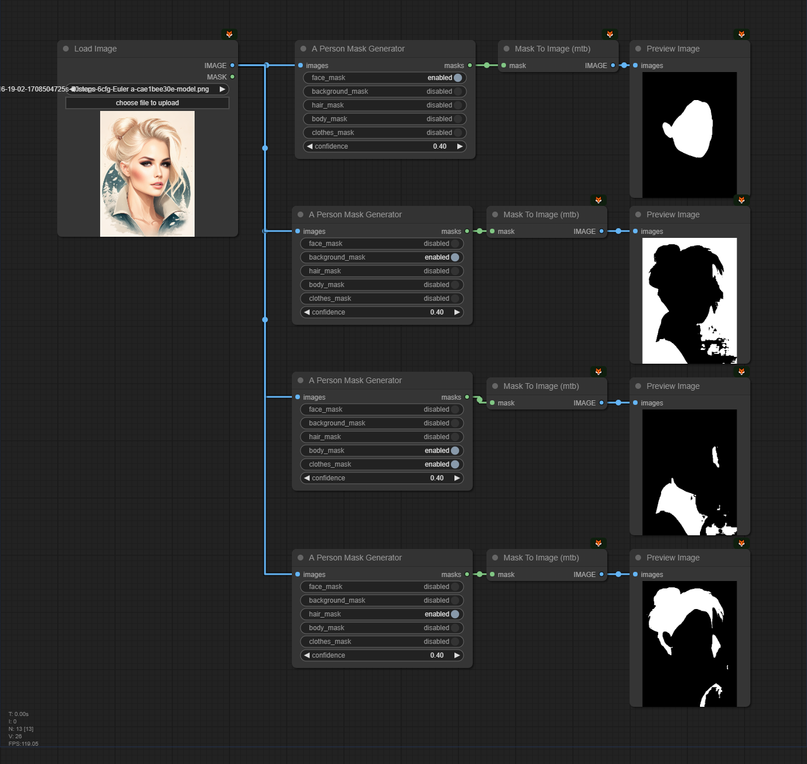
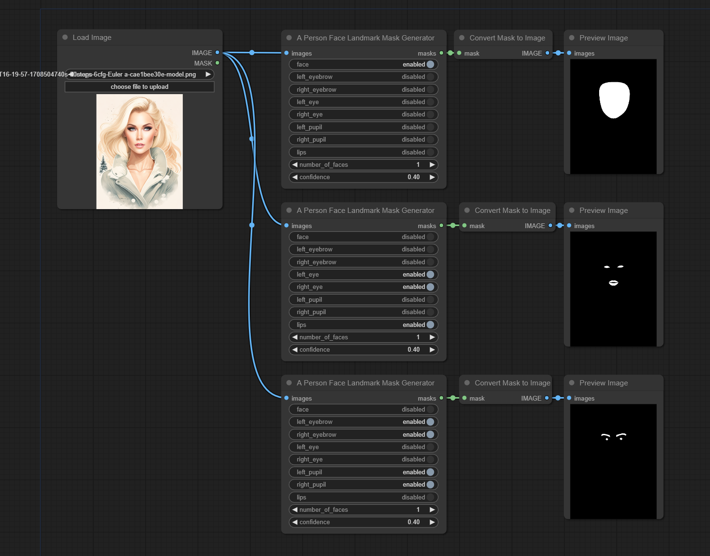
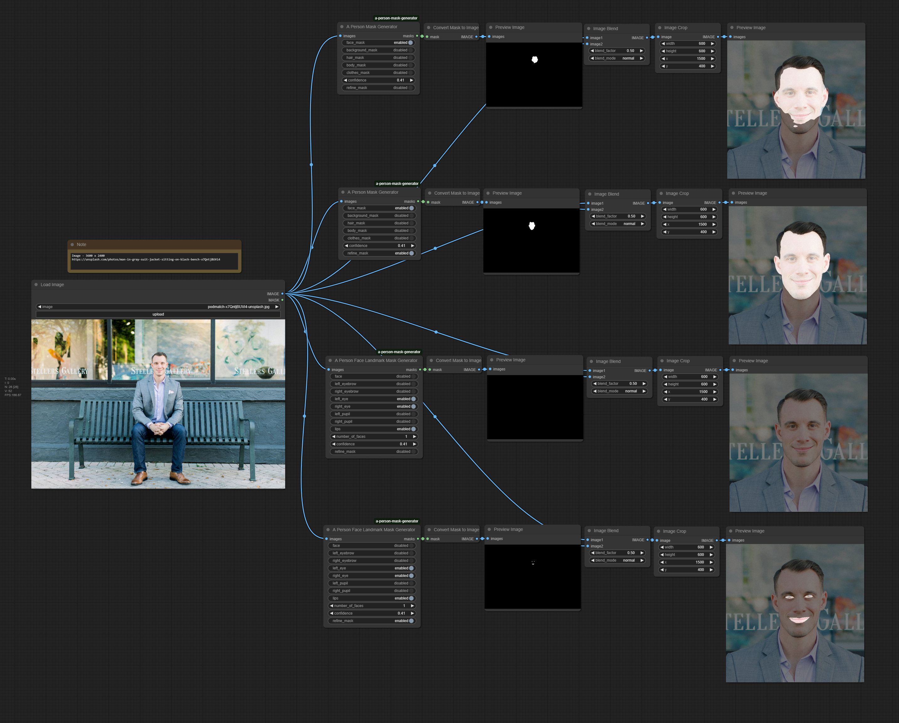

# a-person-mask-generator
Extension for Automatic1111 and ComfyUI to automatically create masks for Background/Hair/Body/Face/Clothes in Img2Img

Uses the [Multi-class selfie segmentation model](https://developers.google.com/mediapipe/solutions/vision/image_segmenter#multiclass-model) model by Google.

## Updates
- 2025-02-19 - Adding mask refinement.  This creates a bounding box around the detected mask, then crops the image to the detected area, then runs a second pass for the mask detection. Especially helpful on large resolution images with the person far away.
- 2025-02-07 - Fixing ComfyUI vs Auto1111 (improved ComfyUI by adding alpha channel to the image that gets passed to media pipe.  See [issue #47](https://github.com/djbielejeski/a-person-mask-generator/issues/47))
- 2024-05-26 - Adding facial landmark mask outputs for ComfyUI
- 2024-05-25 - Fixed ComfyUI requirements and install
- 2024-01-01 - Added ComfyUI support
- 2023-11-16 - Initial release

## Install - ComfyUI

1. Navigate to your ComfyUI folder in a command prompt and activate your `venv`

```cmd
venv\Scripts\activate.bat
```

2. Navigate to your `custom_nodes` folder and run the following commands

```cmd
git clone https://github.com/djbielejeski/a-person-mask-generator
cd a-person-mask-generator
pip install -r requirements.txt
```


If you are using the ComfyUI portable install, run this in `ComfyUI_windows_portable` folder

```cmd
python_embeded\python.exe -m pip install -r ComfyUI\custom_nodes\a-person-mask-generator\requirements.txt
```

3. Restart ComfyUI.


### Full Example
```cmd
D:\ComfyUI> venv\Scripts\activate.bat
(venv) D:\ComfyUI> cd custom_nodes
(venv) D:\ComfyUI\custom_nodes> git clone https://github.com/djbielejeski/a-person-mask-generator
(venv) D:\ComfyUI\custom_nodes> cd a-person-mask-generator
(venv) D:\ComfyUI\custom_nodes\a-person-mask-generator> pip install -r requirements.txt
```


## ComfyUI Example - Person

Workflow embedded in image, drag into ComfyUI to use.

Masks in this order

1) Face
2) Background
3) Body + Clothes
4) Hair



## ComfyUI Example - Face Landmarks




## Refine Mask - 1st and 3rd - `refine_mask = false`, 2nd and 4th - `refine_mask = true`




## Install - Automatic1111 Web UI

(from Mikubill/sd-webui-controlnet)

1. Open "Extensions" tab.
2. Open "Install from URL" tab in the tab.
3. Enter `https://github.com/djbielejeski/a-person-mask-generator.git` to "URL for extension's git repository".
4. Press "Install" button.
5. Wait 5 seconds, and you will see the message "Installed into stable-diffusion-webui\extensions\a-person-mask-generator. Use Installed tab to restart".
6. Go to "Installed" tab, click "Check for updates", and then click "Apply and restart UI". (The next time you can also use this method to update extensions.)
7. Completely restart A1111 webui including your terminal. (If you do not know what is a "terminal", you can reboot your computer: turn your computer off and turn it on again.)


## Automatic1111 Examples

### Face


### Face + Body


### Clothes + Hair


### Mask Settings


