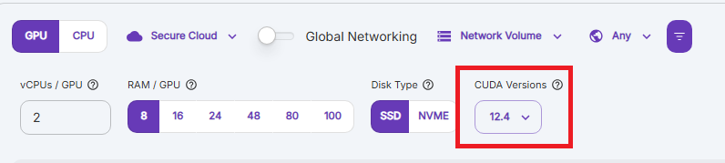

(runpod)=

# 📦 Developing FastVideo on RunPod

You can easily use the FastVideo Docker image as a custom container on [RunPod](https://www.runpod.io) for development or experimentation.

## Creating a new pod

Choose a GPU that supports CUDA 12.8

Pick 1 or 2 L40S GPU(s)



When creating your pod template, use this image:

```
ghcr.io/hao-ai-lab/fastvideo/fastvideo-dev:py3.12-latest
```

Paste Container Start Command to support SSH ([RunPod Docs](https://docs.runpod.io/pods/configuration/use-ssh)):

```bash
bash -c "apt update;DEBIAN_FRONTEND=noninteractive apt-get install openssh-server -y;mkdir -p ~/.ssh;cd $_;chmod 700 ~/.ssh;echo \"$PUBLIC_KEY\" >> authorized_keys;chmod 700 authorized_keys;service ssh start;sleep infinity"
```


After deploying, the pod will take a few minutes to pull the image and start the SSH service.


## Working with the pod

After SSH'ing into your pod, you'll find the `fastvideo-dev` Conda environment already activated.

To pull in the latest changes from the GitHub repo:

```bash
cd /FastVideo
git pull
```

`If you have a persistent volume and want to keep your code changes, you can move /FastVideo to /workspace/FastVideo, or simply clone the repository there.`

Run your development workflows as usual:

```bash
# Run linters
pre-commit run --all-files

# Run tests
pytest tests/
```
