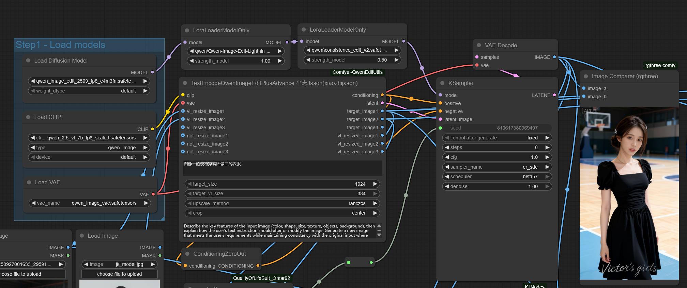

# Comfyui-QwenEditUtils

A collection of utility nodes for Qwen-based image editing in ComfyUI.

## Example

  
  

You can find a complete ComfyUI workflow example in the [`qwen-edit-plus_example.json`](qwen-edit-plus_example.json) file. This workflow demonstrates how to use the TextEncodeQwenImageEditPlus node with two reference images to create an outfit transfer effect.

## Update Log
### v1.1.7
- Use 1,2,3 instead of 0,1,2 for the pro node resize logic

### v1.1.6
- Add new node for new image resize handling

### v1.1.5
- Rollback the vl resize and not resize output sequence

### v1.1.4
- Updated crop method pad to preserve most of the image
- Add CropWithPadInfo to crop generated image with pad info
- Add the initial version node for running hub

## Node

### TextEncodeQwenImageEditPlus 小志Jason(xiaozhijason)

This node provides text encoding functionality with reference image support for Qwen-based image editing workflows. It allows you to encode prompts while incorporating up to 5 reference images for more controlled image generation.

#### Inputs

- **clip**: The CLIP model to use for encoding
- **prompt**: The text prompt to encode
- **vae** (optional): The VAE model for image encoding
- **image1** (optional): First reference image for image editing
- **image2** (optional): Second reference image for image editing
- **image3** (optional): Third reference image for image editing
- **image4** (optional): Fourth reference image for image editing
- **image5** (optional): Fifth reference image for image editing
- **enable_resize** (optional): Enable automatic resizing of the reference image for VAE encoding
- **enable_vl_resize** (optional): Enable automatic resizing of the reference image for VL encoding
- **llama_template** (optional): Custom Llama template for image description and editing instructions

#### Outputs

- **CONDITIONING**: The encoded conditioning tensor
- **image1**: The processed first reference image
- **image2**: The processed second reference image
- **image3**: The processed third reference image
- **image4**: The processed fourth reference image
- **image5**: The processed fifth reference image
- **LATENT**: The encoded latent representation of the first reference image

#### Behavior

- Encodes text prompts using CLIP with optional reference image guidance
- Supports up to 5 reference images for complex editing tasks
- Automatically resizes reference images to optimal dimensions for both VAE and VL encoding
- Integrates with VAE models to encode reference images into latent space
- Supports custom Llama templates for more precise image editing instructions
- Processes images separately for VAE encoding (1024x1024) and VL encoding (384x384)
- Returns individual processed images for more flexible workflow connections

### TextEncodeQwenImageEditPlusAdvance 小志Jason(xiaozhijason)

This advanced node provides enhanced text encoding functionality with reference image support for Qwen-based image editing workflows. It offers more precise control over image resizing and supports flexible image input configurations with separate processing for VAE and VL encoding.

#### Inputs

- **clip**: The CLIP model to use for encoding
- **prompt**: The text prompt to encode
- **vae** (optional): The VAE model for image encoding
- **vl_resize_image1** (optional): First reference image for VL encoding with resizing
- **vl_resize_image2** (optional): Second reference image for VL encoding with resizing
- **vl_resize_image3** (optional): Third reference image for VL encoding with resizing
- **not_resize_image1** (optional): First reference image without VL resizing
- **not_resize_image2** (optional): Second reference image without VL resizing
- **not_resize_image3** (optional): Third reference image without VL resizing
- **target_size** (optional): Target size for VAE encoding (options: 1024, 1344, 1536, 2048, 768, 512)
- **target_vl_size** (optional): Target size for VL encoding (default: 384)
- **upscale_method** (optional): Method for upscaling images (options: "lanczos", "bicubic", "area")
- **crop** (optional): Cropping method (options: "center", "disabled")
- **instruction** (optional): Custom instruction for image editing

#### Outputs

- **CONDITIONING**: The encoded conditioning tensor
- **LATENT**: The encoded latent representation of the first reference image
- **target_image1**: The processed first target reference image
- **target_image2**: The processed second target reference image
- **target_image3**: The processed third target reference image
- **vl_resized_image1**: The first VL-resized reference image
- **vl_resized_image2**: The second VL-resized reference image
- **vl_resized_image3**: The third VL-resized reference image

#### Behavior

- Provides advanced text encoding with separate control over VAE and VL image processing
- Supports 3 reference images with different resize behaviors
- Offers multiple target size options for more flexible image processing
- Maintains separate image outputs for VAE-encoded and VL-resized images
- Provides enhanced upscale and crop controls for optimal image processing
- Integrates with custom instructions for tailored image editing

### TextEncodeQwenImageEditPlusPro 小志Jason(xiaozhijason)

This professional node provides the most flexible text encoding functionality with reference image support for Qwen-based image editing workflows. It offers fine-grained control over which images are VL-resized and includes a main image designation for focused conditioning.

#### Inputs

- **clip**: The CLIP model to use for encoding
- **prompt**: The text prompt to encode
- **vae** (optional): The VAE model for image encoding
- **image1** (optional): First reference image for image editing
- **image2** (optional): Second reference image for image editing
- **image3** (optional): Third reference image for image editing
- **image4** (optional): Fourth reference image for image editing
- **image5** (optional): Fifth reference image for image editing
- **vl_resize_indexs** (optional): Comma-separated indexes of images to apply VL resizing (default: "0,1,2")
- **main_image_index** (optional): Index of the main reference image for focused conditioning (default: 0)
- **target_size** (optional): Target size for VAE encoding (options: 1024, 1344, 1536, 2048, 768, 512)
- **target_vl_size** (optional): Target size for VL encoding (options: 384, 392)
- **upscale_method** (optional): Method for upscaling images (options: "lanczos", "bicubic", "area")
- **crop_method** (optional): Cropping method (options: "pad", "center", "disabled")
- **instruction** (optional): Custom instruction for image editing

#### Outputs

- **CONDITIONING**: The encoded conditioning tensor with all reference latents
- **LATENT**: The encoded latent representation of the main reference image
- **image1**: The processed first reference image
- **image2**: The processed second reference image
- **image3**: The processed third reference image
- **image4**: The processed fourth reference image
- **image5**: The processed fifth reference image
- **CONDITIONING**: The encoded conditioning tensor with only the main reference latent
- **ANY**: The pad information dictionary containing scaling and padding details

#### Behavior

- Provides professional-level text encoding with maximum flexibility for image processing
- Supports up to 5 reference images with configurable VL-resizing per image
- Allows designation of a main reference image for focused conditioning
- Offers separate conditioning outputs for full reference and main reference conditioning
- Provides multiple target size options for more flexible image processing
- Includes pad information for potential image cropping and scaling operations
- Provides enhanced upscale and crop controls, including padding for image preservation

## Key Features

- **Multi-Image Support**: Incorporate up to 3 reference images into your text-to-image generation workflow
- **Dual Resize Options**: Separate resizing controls for VAE encoding (1024px) and VL encoding (384px)
- **Individual Image Outputs**: Each processed reference image is provided as a separate output for flexible connections
- **Latent Space Integration**: Encode reference images into latent space for efficient processing
- **Qwen Model Compatibility**: Specifically designed for Qwen-based image editing models
- **Customizable Templates**: Use custom Llama templates for tailored image editing instructions

## Installation

1. Clone or download this repository into your ComfyUI's `custom_nodes` directory.
2. Restart ComfyUI.
3. The node will be available in the "advanced/conditioning" category.

## Update Log
### v1.1.3
- Updated crop method pad to preserve most of the image
- Add CropWithPadInfo to crop generated image with pad info

### v1.0.6
- Updated advance node

### v1.0.5
- Updated node to support separate enable_vl_resize parameter
- Modified return types to provide 5 individual IMAGE outputs instead of a single combined output
- Improved image processing logic with separate handling for VAE and VL encoding
- Enhanced documentation to accurately reflect node inputs and outputs
- Fixed latent output handling to properly return first reference image latent

### v1.0.1
- Initial release with basic text encoding and single image reference support

## Contact
- **Twitter**: [@Lrzjason](https://twitter.com/Lrzjason)  
- **Email**: lrzjason@gmail.com  
- **QQ Group**: 866612947  
- **Wechatid**: fkdeai
- **Civitai**: [xiaozhijason](https://civitai.com/user/xiaozhijason)

## Sponsors me for more open source projects:

  <table>
    <tr>
      <td align="center">
        
Buy me a coffee:

        
      </td>
      <td align="center">
        
WeChat:

        
      </td>
    </tr>
  </table>

