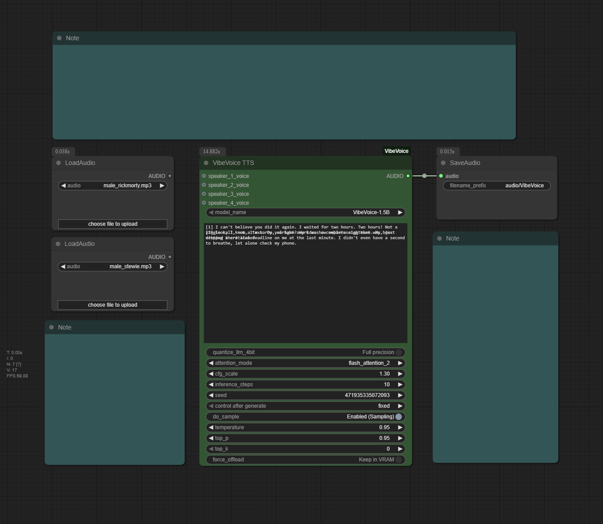

<!-- Improved compatibility of back to top link: See: https://github.com/othneildrew/Best-README-Template/pull/73 -->
<a id="readme-top"></a>

<div align="center">
  <h1 align="center">ComfyUI-VibeVoice</h1>


  <p align="center">
    A custom node for ComfyUI that integrates Microsoft's VibeVoice, a frontier model for generating expressive, long-form, multi-speaker conversational audio.
    <br />
    <br />
    <a href="https://github.com/wildminder/ComfyUI-VibeVoice/issues/new?labels=bug&template=bug-report---.md">Report Bug</a>
    ·
    <a href="https://github.com/wildminder/ComfyUI-VibeVoice/issues/new?labels=enhancement&template=feature-request---.md">Request Feature</a>

<!-- PROJECT SHIELDS -->
[![Stargazers][stars-shield]][stars-url]
[![Issues][issues-shield]][issues-url]
[![Contributors][contributors-shield]][contributors-url]
[![Forks][forks-shield]][forks-url]
  </p>
</div>


<!-- ABOUT THE PROJECT -->
## About The Project

VibeVoice is a novel framework by Microsoft for generating expressive, long-form, multi-speaker conversational audio. It excels at creating natural-sounding dialogue, podcasts, and more, with consistent voices for up to 4 speakers.

<div align="center">
      
  </div>

The custom node handles everything from model downloading and memory management to audio processing, allowing you to generate high-quality speech directly from a text script and reference audio files.

**✨ Key Features:**
*   **Multi-Speaker TTS:** Generate conversations with up to 4 distinct voices in a single audio output.
*   **High-Fidelity Voice Cloning:** Use any audio file (`.wav`, `.mp3`) as a reference for a speaker's voice.
*   **Hybrid Generation Mode:** Mix and match cloned voices with high-quality, zero-shot generated voices in the same script.
*   **Flexible Scripting:** Use simple `[1]` tags or the classic `Speaker 1:` format to write your dialogue.
*   **Advanced Attention Mechanisms:** Choose between `eager`, `sdpa`, `flash_attention_2`, and the high-performance `sage` attention for fine-tuned control over speed and compatibility.
*   **Robust 4-Bit Quantization:** Run the large language model component in 4-bit mode to significantly reduce VRAM usage.
*   **Automatic Model Management:** Models are downloaded automatically and managed efficiently by ComfyUI to save VRAM.

<p align="right">(<a href="#readme-top">back to top</a>)</p>

<!-- GETTING STARTED -->
## 🚀 Getting Started

The easiest way to install is through the **ComfyUI Manager:**
1.  Go to `Manager` -> `Install Custom Nodes`.
2.  Search for `ComfyUI-VibeVoice` and click "Install".
3.  Restart ComfyUI.

Alternatively, to install manually:

1.  **Clone the Repository:**
    Navigate to your `ComfyUI/custom_nodes/` directory and clone this repository:
    ```sh
    git clone https://github.com/wildminder/ComfyUI-VibeVoice.git
    ```

2.  **Install Dependencies:**
    Open a terminal or command prompt, navigate into the cloned directory, and install the required Python packages. **For quantization support, you must install `bitsandbytes`**.
    ```sh
    cd ComfyUI-VibeVoice
    pip install -r requirements.txt
    ```

3.  **Optional: Install SageAttention**
    To enable the `sage` attention mode, you must install the `sageattention` library. For Windows users, a pre-compiled wheel is available at [AI-windows-whl](https://github.com/wildminder/AI-windows-whl).
    > **Note:** This is only required if you intend to use the `sage` attention mode.

4.  **Start/Restart ComfyUI:**
    Launch ComfyUI. The "VibeVoice TTS" node will appear under the `audio/tts` category. The first time you use the node, it will automatically download the selected model to your `ComfyUI/models/tts/VibeVoice/` folder.

## Models
| Model | Context Length | Generation Length |  Weight |
|-------|----------------|----------|----------|
| VibeVoice-1.5B | 64K | ~90 min | [HF link](https://huggingface.co/microsoft/VibeVoice-1.5B) |
| VibeVoice-Large| 32K | ~45 min | [HF link](https://huggingface.co/aoi-ot/VibeVoice-Large) |

<p align="right">(<a href="#readme-top">back to top</a>)</p>

<!-- USAGE EXAMPLES -->
## 🛠️ Usage

The node is designed for maximum flexibility within your ComfyUI workflow.

1.  **Add Nodes:** Add the `VibeVoice TTS` node to your graph. Use ComfyUI's built-in `Load Audio` node to load your reference voice files.
2.  **Connect Voices (Optional):** Connect the `AUDIO` output from each `Load Audio` node to the corresponding `speaker_*_voice` input.
3.  **Write Your Script:** In the `text` input, write your dialogue using one of the supported formats.
4.  **Generate:** Queue the prompt. The node will process the script and generate a single audio file containing the full conversation.

> **Tip:** For a complete workflow, you can drag the example image from the `example_workflows` folder onto your ComfyUI canvas.

### Scripting and Voice Modes

#### Speaker Tagging
You can assign lines to speakers in two ways. Both are treated identically.

*   **Modern Format (Recommended):** `[1] This is the first speaker.`
*   **Classic Format:** `Speaker 1: This is the first speaker.`

You can also add an optional colon to the modern format (e.g., `[1]: ...`). The node handles all variations consistently.

#### Hybrid Voice Generation
This is a powerful feature that lets you mix cloned voices and generated (zero-shot) voices.

*   **To Clone a Voice:** Connect a `Load Audio` node to the speaker's input (e.g., `speaker_1_voice`).
*   **To Generate a Voice:** Leave the speaker's input empty. The model will create a unique, high-quality voice for that speaker.

**Example Hybrid Script:**
```
[1] This line will use the audio from speaker_1_voice.
[2] This line will have a new, unique voice generated for it.
[1] I'm back with my cloned voice.
```
In this example, you would only connect an audio source to `speaker_1_voice`.

### Node Inputs

*   **`model_name`**: Select the VibeVoice model to use (`1.5B` or `Large`).
*   **`text`**: The conversational script. See "Scripting and Voice Modes" above for formatting.
*   **`quantize_llm_4bit`**: Enable to run the LLM component in 4-bit (NF4) mode, dramatically reducing VRAM usage.
*   **`attention_mode`**: Select the attention implementation: `eager` (safest), `sdpa` (balanced), `flash_attention_2` (fastest), or `sage` (quantized high-performance).
*   **`cfg_scale`**: Controls how strongly the model adheres to the reference voice's timbre. Higher values are stricter. Recommended: `1.3`.
*   **`inference_steps`**: Number of diffusion steps for audio generation. Recommended: `10`.
*   **`seed`**: A seed for reproducibility. Set to 0 for a random seed on each run.
*   **`do_sample`, `temperature`, `top_p`, `top_k`**: Standard sampling parameters for controlling the creativity and determinism of the speech generation.
*   **`force_offload`**: Forces the model to be completely offloaded from VRAM after generation.

<!-- PERFORMANCE SECTION -->
## ⚙️ Performance & Advanced Features

This node features a sophisticated system for managing performance, memory, and stability.

### Feature Compatibility & VRAM Matrix

| Quantize LLM | Attention Mode      | Behavior / Notes                                                                                                                                | Relative VRAM |
| :----------- | :------------------ | :---------------------------------------------------------------------------------------------------------------------------------------------- | :------------ |
| **OFF**      | `eager`             | Full Precision. Most compatible baseline.                                                                                                       | High          |
| **OFF**      | `sdpa`              | Full Precision. Recommended for balanced performance.                                                                                           | High          |
| **OFF**      | `flash_attention_2` | Full Precision. High performance on compatible GPUs.                                                                                            | High          |
| **OFF**      | `sage`              | Full Precision. Uses high-performance mixed-precision kernels.                                                                                  | High          |
| **ON**       | `eager`             | **Falls back to `sdpa`** with `bfloat16` compute. Warns user.                                                                                   | **Low**       |
| **ON**       | `sdpa`              | **Recommended for memory savings.** Uses `bfloat16` compute.                                                                                    | **Low**       |
| **ON**       | `flash_attention_2` | **Falls back to `sdpa`** with `bfloat16` compute. Warns user.                                                                                   | **Low**       |
| **ON**       | `sage`              | **Recommended for stability.** Uses `fp32` compute to ensure numerical stability with quantization, resulting in slightly higher VRAM usage.     | **Medium**    |


<!-- CHANGELOG -->
## Changelog

<details open>
<summary><strong>v1.5.0 - Stability and Prompting</strong></summary>

### ✨ New Features & Improvements
*   **Total Generation Stability:** Fixed the bug where a speaker's voice could unintentionally change or blend with another reference voice mid-sentence.
*   **Improved Voice Cloning Fidelity** 
*   **Consistent Speaker Tagging:** The node now intelligently handles multiple script formats (`[1]`, `[1]:`, and `Speaker 1:`) to produce identical, high-quality results, removing all previous inconsistencies.
*   **Hybrid Voice Generation:** Mix and match cloned voices with high-quality, zero-shot generated voices in the same script. If a speaker's voice input is empty, a unique voice will be generated for them automatically.
</details>

<details>
<summary><strong>v1.3.0 - SageAttention & Quantization Overhaul</strong></summary>

*   **SageAttention Support:** Full integration with the `sageattention` library for a high-performance, mixed-precision attention option.
*   **Robust 4-Bit LLM Quantization:** The "Quantize LLM (4-bit)" option is now highly stable and delivers significant VRAM savings.
*   **Smart Configuration & Fallbacks:** The node now automatically handles incompatible settings (e.g., 4-bit with `flash_attention_2`) by gracefully falling back to a stable alternative (`sdpa`) and notifying the user.
</details>

<details>
<summary><strong>v1.2.0 - Compatibility Update</strong></summary>

*   **Transformers Library:** Includes automatic detection and compatibility for both older and newer versions of the Transformers library (pre- and post-4.56).
*   **Bug Fixes:** Resolved issues with `Force Offload` and multi-speaker generation on newer Transformers versions.
</details>

<p align="right">(<a href="#readme-top">back to top</a>)</p>

### Tips from the Original Authors

*   **Punctuation:** For Chinese text, using English punctuation (commas and periods) can improve stability.
*   **Model Choice:** The 7B model variant (`VibeVoice-Large`) is generally more stable.
*   **Spontaneous Sounds/Music:** The model may spontaneously generate background music, especially if the reference audio contains it or if the text includes introductory phrases like "Welcome to...". This is an emergent capability and cannot be directly controlled.
*   **Singing:** The model was not trained on singing data, but it may attempt to sing as an emergent behavior. Results may vary.

<p align="right">(<a href="#readme-top">back to top</a>)</p>

<!-- LICENSE -->
## License

This project is distributed under the MIT License. See `LICENSE.txt` for more information. The VibeVoice model and its components are subject to the licenses provided by Microsoft. Please use responsibly.

<p align="right">(<a href="#readme-top">back to top</a>)</p>

<!-- ACKNOWLEDGMENTS -->
## Acknowledgments

*   **Microsoft** for creating and open-sourcing the [VibeVoice](https://github.com/microsoft/VibeVoice) project.
*   **The ComfyUI team** for their incredible and extensible platform.

<p align="right">(<a href="#readme-top">back to top</a>)</p>

## Star History

[](https://www.star-history.com/#wildminder/ComfyUI-VibeVoice&Timeline)


<!-- MARKDOWN LINKS & IMAGES -->
[contributors-shield]: https://img.shields.io/github/contributors/wildminder/ComfyUI-VibeVoice.svg?style=for-the-badge
[contributors-url]: https://github.com/wildminder/ComfyUI-VibeVoice/graphs/contributors
[forks-shield]: https://img.shields.io/github/forks/wildminder/ComfyUI-VibeVoice.svg?style=for-the-badge
[forks-url]: https://github.com/wildminder/ComfyUI-VibeVoice/network/members
[stars-shield]: https://img.shields.io/github/stars/wildminder/ComfyUI-VibeVoice.svg?style=for-the-badge
[stars-url]: https://github.com/wildminder/ComfyUI-VibeVoice/stargazers
[issues-shield]: https://img.shields.io/github/issues/wildminder/ComfyUI-VibeVoice.svg?style=for-the-badge
[issues-url]: https://github.com/wildminder/ComfyUI-VibeVoice/issues
